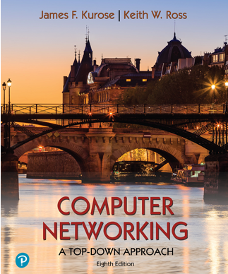

# CS network

네트워크 공부 내용을 정리한 것을 모아 놓은 repository 입니다.

## 1. book

주로 다음 책의 내용을 바탕으로 공부를 진행

  

- Computer Networking: a top-down approach

## 2. references

- [한양대학교 이석복 교수님 - 컴퓨터 네트워크](http://www.kocw.net/home/search/kemView.do?kemId=1312397)
- [면접을 위한 CS 전공지식 노트](https://shopping.interpark.com/product/productInfo.do?prdNo=9390719561&gclid=Cj0KCQjwof6WBhD4ARIsAOi65aiDYQ2vAtCD6CxfcM5vPnEvetAwzIPLkhkHMHZZ_NLXlFX-hgRxMxAaAvD6EALw_wcB)
- [esyeonge님 tistory](https://esyeonge.tistory.com/category/%EA%B3%B5%EB%B6%80/%EB%84%A4%ED%8A%B8%EC%9B%8C%ED%81%AC)
