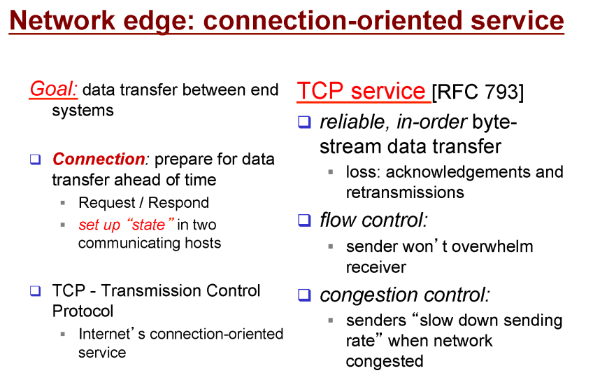
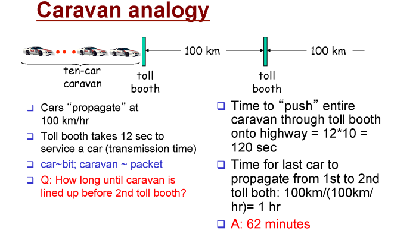

# 컴퓨터 네트워크 기본

```
한양대학교 이석복 교수님의 컴퓨터네트워크 강의를 요약한 글임을 미리 밝힙니다. 문제가 될 경우 삭제 조치 하겠습니다.
```

## TOC

1. [Network structure](#1-Network-structure)
2. [The network edge](#2-the-network-edge)
3. [Connection-oriented service](#3-connection-oriented-service)
4. [Connectionless-service](#4-connectionless-service)
5. [Protocol](#5-protocol)
6. [The network core](#6-the-network-core)
7. [Circuit switching](#7-circuit-switching)
8. [Packet switching: statistical multiplexing](#8-packet-switching-statistical-multiplexing)
9. [Packet switching vs Circuit switching](#9-packet-switching-vs-circuit-switching)
10. [Four sources of packet delay](#10-four-sources-of-packet-delay)

---

## 1. Network structure

우리는 지금 수많은 노드들로 이루어진 인터넷 속에 살아간다. 네트워크는 둘 이상의 노드들이
서로 연결하는 링크의 조합이라고 정의한다. 그 네트워크 구조에는 다음과 같은 요소가 있다.

<p align ="center">

</p>

## 2. The network edge

<p align ="center">

</p>

- network edge에는 client/server라고 불리는 컴퓨터들이 있다.
- 또는 peer-peer model을 이용하는 컴퓨터등이 있다.
- host라고 불리는 end systems등이 network의 가장자리에 있다고 표현할 수 있다.
- host가 client인 경우에는 데스크탑이나 스마트폰이 된다
- server인 경우 웹 페이지나 미디어를 저장하고 제공하는 큰 컴퓨터가 될 수 있다.

> network edge에는 클라이언트/서버라고 불리는 컴퓨터가 있다고 생각하면 된다.

## 3. Connection-oriented service

<p align ="center">

</p>

- 기본적으로 인터넷에는 데이터 전송 서비스에는 두가지가 있다. (연결지향, 비연결지향)
- 연결지향의 대표적인 예로 TCP가 있다.
- 여기서 전송 서비스는 edge network에 있는 end system들이 담당한다.
- 인텔리전트 기능들은 네트워크 종단에 집약되어 있다.
- network core의 라우터들은 패킷을 전송하기만 한다.
- 이러한 core의 특성을 빗대어 dumb core라고도 한다.

> TCP(Transmission Control Protocol)은 인터넷의 연결지향서비스로서 양방향 데이터 통신을 제공한다.

```
흐름 제어(flow control) : sender는 receiver의 성능에 맞게 데이터를 전송하도록 제어
혼잡 제어(congestion control) : 현재 네트워크 상황에 맞게 데이터 전송을 제어
```

## 4. Connectionless service

- 연결지향 데이터 전송 서비스인 TCP와 대조적으로 비연결 지향 서비스인 UDP가 있다.
- UDP(User Datagram Protocol)은 흐름제어 혼잡제어을 안한다.
- TCP에 비해 신뢰성이 부족한 비연결 지향서비스다.
- 데이터 유실을 감당할 수 있는 경우 UDP를 사용할 수 있다.
- 컴퓨팅 리소스, 네트워크 리소스를 줄일 수 있다. (그냥 보내기만 하면 되니깐)
- 예로는 streaming media, 원격 회의, dns, internet telephony등이 있다.

> Connectionless, unreliable data transter, no flow control, no congestion control

## 5. Protocol

프로토콜은 서로 다른 기기들이 통신을 하기 위한 표준 인터페이스 등을 말한다. 사람들 끼리 소통을 하기 위해서 프로토콜을 사용한다고 생각하면 된다.

> All communication in Internet coordinated by protocols

## 6. The Network Core

<p align ="center">

</p>

- 네트워크의 핵심부분에는 수많은 라우터들이 있다.
- 이 라우터끼리 정보를 전달하는데 그 정보 전달 방법에는 Circuit Switching과 Packet Switching이 있다.

> mesh of interconnected routers.

## 7. Circuit Switching

<p align ="center">

</p>

- Circuit Switching은 유선전화망을 생각하면 된다.
- 특정 유저를 위한 길, 즉 회선의 경로를 미리 예약한다.

## 8. Packet Switching: Statistical Multiplexing

<p align ="center">

</p>

- 패킷 스위칭은 라우터가 들어온 패킷을 알맞은 곳으로 그냥 보내는 방식이다.
- 목적지를 정해두고 메세지를 패킷으로 쪼개서 보낸뒤 목적지에서 패킷을 조립해서 확인하는 방식이다.

> 패킷 교환 방식이란 컴퓨터 네트워크와 통신의 방식 중 하나로 현재 가장 많은 사람들이 사용하는 방식입니다. 작은 블록의 패킷으로 데이터를 전송하며 데이터를 전송하는 동안만 네트워크 자원을 사용하도록 하는 방법을 말합니다. -wiki-

## 9. Packet Switching vs Circuit Switching

<p align ="center">

</p>

- 대역폭이 1 Mb/s인 Link가 있다고 가정
- active 상태일때 100 kb/s 데이터 전송
- Circuit Switching 방식은 10명의 사용자만 사용 가능
- Packet Switching 방식은 인원수에 제한이 없다.
  - 35명이라고 가정했을 때, 동시에 10명이 사용할 확률은 0.0004% 보다 적음

> 인터넷에서는 Packet Switching 방식이 채택된다.

## 10. Four sources of packet delay

<p align ="center">

</p>

> Packet Switching 방법에는 4가지 딜레이가 존재

**노드 처리 지연(nodal processing delay):**

- Bit error를 검사하거나, Output link를 결정하는 등 노드에서 처리 하는 중 걸리는 지연시간
- 라우터의 성능을 높이면 지연을 줄일 수 있다.

---

**큐잉 지연(queuing delay):**

- Outgoing edge 로 나가는 속도에 비해 라우터에 들어오는 데이터가 많다면 손실이 생긴다.
- 이러한 손실을 막기 위해 라우터에 큐를 만들어 대기 시킨다.
- 지연을 줄이기 어렵다. (라우터 혼잡 수준에 의존)

---

**전송 지연(Transmission delay):**

- 패킷의 모든 비트들이 링크로 나가는데 걸리는 시간이다.
- R = 링크 대역폭 (bps)
- L = 패킷 길이 (bits)
- Transmission delay = `L/R`
- 링크의 대역폭을 늘리는 것으로 지연을 줄일 수 있다.

---

**전파 지연(propagation delay):**

- 링크에서 다음 라우터로 전파되는데 필요한 시간이다.
- d = 물리적 링크의 길이
- s = 매체의 전파 속도(2 \* 10^8 m/sec ~ 3 \* 10^8 m/sec)
- propagation delay = `d/s`

**고속도로 상황의 비유해서 지연을 이해하기**

<p align ="cetner">

</p>

- 차량 10대는 한꺼번에 다녀야한다. (패킷과 유사 : 10비트 패킷)
- 차는 시속 100km로 달린다. Propagation delay(전파 지연)
- 모든 차량이 첫 라우터(톨게이트)를 지나가는 순간까지의 걸린 시간
  은 Transmission delay(전송 지연)
- Trasmission 딜레이는 라우터가 패킷을 내보내는 데 필요한 시간이다.
- 위 예시에서 모든 차량이 톨게이트를 나오는 시간은 120초
