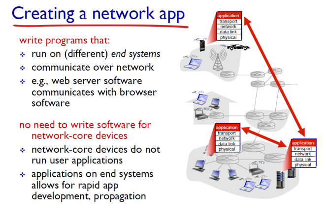
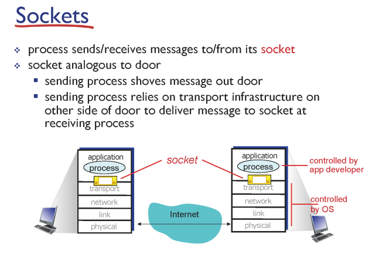
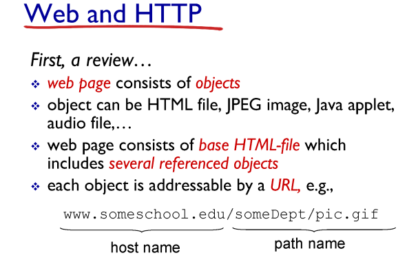
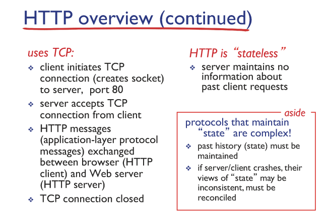

# 애플리케이션 계층

```
한양대학교 이석복 교수님의 컴퓨터네트워크 강의를 요약한 글임을 미리 밝힙니다. 문제가 될 경우 삭제 조치 하겠습니다.
```

## TOC

1. [Create a network app](#1-create-a-network-app)
2. [Client-server architecture](#2-client-server-architecture)
3. [Processes communicating](#3-processes-communicating)
4. [Sockets](#4-sockets)
5. [앱이 필요로 하는 전송 서비스 요구 사항](#5-앱이-필요로-하는-전송-서비스-요구-사항)
6. [Internet apps : application, transport protocols](#6-internet-apps--application-transport-protocols)
7. [Web and HTTP](#7-web-and-http)
8. [HTTP overview](#8-http-overview)
9. [HTTP connections](#9-http-connections)
10. [Non-persistent HTTP](#10-non-persistent-http)
11. [Non-persistent HTTP: response time](#11-non-persistent-http-response-time)
12. [Persistent HTTP](#12-persistent-http)
13. [HTTP request message](#13-http-request-message)
14. [HTTP response message](#14-http-response-message)
15. [Cookies](#15-cookies)
16. [Web cache](#16web-cache)
17. [Condition GET](#17-condition-get)
18. [DNS](#18-dns)
19. [Electronic mail](#19-electronic-mail)

---

## 1. Create a network app

<p align ="center">

</p>

`network app`: 운영체제 위에서 실행되는 프로세스들이 다른 머신에 있는 프로세스와 메시지를 주고 받는 것

> 우리는 기본적으로 네트워크 앱을 개발할 때 Network core의 라우터를 신경쓸 필요가 없다. 우리의 네트워크 앱은 다른 End Systems들과의 Communication만 신경쓰면 된다. 왜냐하면 라우터들은 바보라서 네트워크 레이어까지만 지원하기 때문이다.

## 2. Client-server architecture

<p align ="center">

</p>

> 서버는 permanent한 IP 주소를 가져야 한다. 반면 클라이언트는 고정된 IP가 아니여도 괜찮다.

## 3. Processes communicating

<p align ="center">

</p>

- 호스트 안에서 실행중인 프로그램을 프로세스라고 한다.
- 같은 호스트 안에서 두개의 프로세스간의 통신을 하기 위해서는 inter-process commnication(defined by os)를 이용한다.
- 다른 호스트 환경에 존재하는 프로세스 간의 통신을 하기 위해서는 Message exchange를 사용한다.
- `client process`: 통신을 시작하는 프로세스
- `server process`: 통신 연결을 기다리는 프로세스

## 4. Sockets

<p align ="center">

</p>

- 프로세스들은 소켓을 통해서 메시지들을 보내거나 받는다.
- 다른 컴퓨터와 데이터를 통신하기 위한 인터페이스
- IP와 port를 이용해서 통신한다.

## 5. 앱이 필요로 하는 전송 서비스 요구 사항

<p align ="center">

</p>

> 전송 서비스에는 여러가지 요구 사항이 있을 수 있다. 전송 계층 프로토콜 TCP에서는 Data integrity만을 보장한다. 나머지는 어플리케이션 레이어에서 해결한다.

- `Data integrity` : 데이터가 유실되지 않고, 온전히 목적지까지 도달하는 것을 보장하는 것에 대한 요구사항
- `Timing` : 시간적인 요구사항, 적은 지연을 요구사항 예시로는 전화나 상호작용이 중요한 게임이 있다.
- `Throughput`: 처리량과 관련된 요구사항, 멀티미디어 어플리케이션이 예시다.
- `Security`: 보안과 관련된 요구사항

## 6. Internet apps : application, transport protocols

<p align ="center">

</p>

## 7. Web and HTTP

<p align ="center">

</p>

- `HTTP(hypertext transfer protocol)`는 웹 어플리케이션 레이어 프로토콜

- 클라이언트(대표적으로 브라우저)가 리퀘스트를 보내고 결과를 받을 때 HTTP 프로토콜을 사용해서 받는다. 또한 받은 Web object들을 화면에 표시한다.

- 반면 서버는 HTTP 프로토콜을 이용해서 Web object들을 클라이언트에게 보낸다.(Response)

## 8. HTTP overview

<p align ="center">

</p>
<p align ="center">

</p>

- HTTP는 TCP위에서 작동하는 어플리케이션 레이어 프로토콜이다.
- 클라이언트는 TCP 커넥션을 80번 포트를 이용해서 연다.
- 서버는 TCP 커넥션을 받는다.
- HTTP는 stateless
  - 이전의 클라이언트의 리퀘스트 정보를 유지하지 않는다.
  - 즉, 상태를 저장하지 않는다.

## 9. HTTP connections

<p align ="center">

</p>

> HTTP가 TCP 커넥션을 사용하는 방식에 따라서 두가지로 나뉘어 진다. TCP 커넥션을 유지시킬 것인가 아닌가에 따라 나뉘어 진다고 볼 수 있다. (TCP 커넥션 재사용 여부)

## 10. Non-persistent HTTP

<p align ="center">

</p>

<p align ="center">

</p>

> Non-persistent인 경우 서버의 응답 이후에 위 처럼 TCP 커넥션을 끊는다. 파일이 더 필요할 경우 TCP 커넥션을 다시 열고 리퀘스트를 전송해야한다. 현대의 HTTP는 persistent HTTP를 사용한다.

- 클라이언트가 서버에게 10개의 인덱스를 가지고 있는 www.someSchool.edu를 요청하려고 한다.

- Non-persistent HTTP 방식에서는 이미지 10개를 요청하는 작업을 이미지 1개당 1번으로 총 10번 수행한다.

## 11. Non-persistent HTTP: response time

<p align ="center">

</p>

- `initiate TCP` : 사전에 연결하기 위해 보내는 것으로, 이 과정에 소요되는 시간을 2RTT 정도로 본다.

- `RTT` : 메시지 보내고 오는 시간

- `time to transmit` : 실제 파일이 실려서 오는 부분이기 때문에, 이 요청에 대한 인스턴스 자체는 크다.

## 12. Persistent HTTP

이미 연결한 TCP 커넥션을 이용해서 메시지를 주고 받을 수 있다.

<p align ="center">

</p>

- Control Messages(ex. TCP handshake, HTTP request) = K bit long
- Base HTML object = L bits
- N reference objects, each L bit long
- Link bandwidth = R bps
- Propagation delay = d seconds

(1) TCP Connection을 위한 K 비트 메시지가 전송됨

(2) 1번에서 보낸 시간을 0초라고 하면, 서버에 도착한 시간은 K(메시지크기)/bandwidth+delay가 됨

cf) delay : 제일 마지막에 있는 비트가 도착할 때까지 걸리는 시간

(3) 보내는 시간은 K/R+d가 소요됨

(4) HTTP Request를 보낼 수 있음

(5) HTTP Request 역시 보내는데 K/R+d만큼의 시간이 걸림

(6) Basic HTML의 크기가 L임

(7) Basic HTML을 기준으로 L/R+d만큼의 시간이 걸림

이때 n개의 오브젝트를 가져와야 하는데 persistent이기 때문에 (4)-(7)을 10번 반복하면 된다.

> 정답 : n\*k/r+d

## 13. HTTP request Message

<p align ="center">

</p>

## 14. HTTP response Message

<p align ="center">

</p>

## 15. Cookies

> HTTP 의 stateless를 보완하기 위해서 등장했다.

<p align ="center">

</p>

## 16.Web Cache

> Proxy에 미리 웹 컨텐츠를 저장해서 캐싱할 수 있다.

장점 :

- 클라이언트 입장에서 빠르다
- 서버 입장에서 트래픽이 줄어든다.
- 운영자 입장에서 트래픽이 감소해서 비용이 저렴해진다.

단점 :

- 보안
- 캐시가 가지고 있는 것과 서버가 가지고 있는 것의 일관성 이슈

---

**캐시 예제 :**

<p align ="center">

</p>

- 한양대학교 네트워크 안에 컴퓨터가 있다. → 1Gbps LAN
- 한양대학교에서 외부로 나가는 네트워크 대역폭은 15.4Mbps → 폭이 좀 더 좁다.
- 브라우저들이 초당 15번 리퀘스트
- 각 오브젝트의 사이즈가 1 메가바이트이기 때문에 초당 브라우저로 들어오는 트래픽은 15 Mbps
- 라우터에서 서버로 갔다가 서버로 돌아오는 시간은 2초 (RTT)

> 내부 사용률이 15퍼이고, 딜레이는 없다, 문제는 외부랑 연결되는 것이다.
> 평균이 15.4라는 건 15.4보다 큰 값이 존재한다는 의미이기 때문에 큰 값이 들어오면 지연이 생긴다.

**결과 :**

- 기본 외부 왕복 시간 (인터넷 지연) : 2초
- 엑세스 링크 지연 : minutes
- 내부 랜 딜레이 : usecs

---

**솔루션 1.**
이 문제를 해결하기 위해서 케이블 확장 공사를 해서 10배를 늘렸다고 생각해보자.

<p align ="center">

</p>

- 가장 직관적인 해결책이다.

- 이렇게 하면 utilization이 10분의 1로 떨어진다.

- 154차선에서 9.9만 이동하게 되니까 수분 걸리던 access delay가 msecs가 되면서 엄청나게 빠르게 접근할 수 있게 된다.

- 문제는 비용이 엄청나게 든다는 것이다. 이때 사용하는 것이 웹 프록시이다.

**솔루션 2.**

<p align ="center">

</p>

- 요청하는 파일들의 40퍼센트를 local web cache가 가지고 있다고 생각하자.

- 그럴 경우에 외부에서 처리하는 것은 60퍼가 된다.

- 외부에서 처리하는 게 60퍼로 줄어들면서, 총 소요 시간은 약 1.2초 정도가 된다.

- 즉, 케이블 확장 공사를 했을 때보다(2.x초) 더 좋은 효과를 낼 수 있는 것이다.

## 17. Condition GET

> 캐시의 일관성 문제를 해결하기 위해서는 Condition GET을 사용한다.

- 파일을 요청할 때 `If-modified-since: <date>` 를 함께 요청하면서 파일이 이 시간 이후로 수정이 되었는지 비교를 한다.

- 수정이 안 되었을 경우에는 첫 줄에 304 not modified를 전송하고,
- 수정이 되어 있는 상태면 파일을 담아서 보낸다. (200 OK)

<p align ="center">

</p>

## 18. DNS

> DNS는 전화번호부라고 생각하면 쉽다.

- 우리가 www.google.com을 입력했을 때 www.google.com에 해당되는 IP주소를 찾아서 매핑해주는 것이 DNS이다.

**DNS 서버를 한 대만 사용할 때 문제점 :**

- 검색시간이 오래 걸림
- 사람이 몰려서 서비스가 느려짐
- 서버가 다운될 경우, 웹 브라우징을 하기 어렵다.

> 따라서 검색 속도가 빠르고 관리가 용이하도록 분산과 계층화를 시켜야 한다.

<p align ="center">

</p>

---

**TLD, authoritative servers :**

- `top-level domain(TLD) server` : .com, .org, .net 같은 도메인을 담고 있는 서버

- `authoriative DNS server` : 네트워크를 운영하는 기관에서 보유하고 있는 도메인의 경우, 기관에서 매핑에 대한 수행을 하기 위해 운영하는 DNS 서버(ex. hanyang.edu라는 도메인에 속한 사이트들)

---

**Local DNS name server :**

> 내부에서 요청되는 DNS 쿼리들에 대한 결과를 캐싱하고 있는 곳(호스트와 아이피를 매칭한 결과를 저장) 여기서 거의 cache hit이 발생한다.

---

**DNS name resolution example :**

<p align ="center">

</p>

> 위의 그림은 hostname을 가지고 ip주소를 알아오는 과정을 그린 것이다.

여기서는 poly.edu 학교가 gaia.cs.umass.edu 학교에 메시지를 보내려고 하는 것이다.

(1) 호스트 IP를 알아내기 위해서 local DNS server에 물어봄

(2) local DNS server에 없을 경우 root DNS server에 가서 호스트 IP를 물어봄

(3) root는 호스트 IP를 알 수도 있는 TLD DNS server 주소를 알려줌

(4) TLD DNS Server 주소에 호스트 IP를 물어봄

(5) TLD DNS Server는 호스트 IP를 알고 있는 authoritative DNS server의 주소를 알려줌

(6) authoritative DNS server에 호스트 IP를 물어봄

(7) authoritative DNS server는 호스트 IP를 알려줌

(8) local DNS server는 authoritative DNS server로부터 받은 호스트 IP를 알려줌

---

**DNS: caching, update records :**

> 일관성 문제의 대응책으로 TTL이라는 필드를 사용한다. TTL이 지나면 레코드는 expire된다.

---

**DNS records :**

<p align ="center">

</p>

- `type=A일` 경우: name = hostname, value = IP

- `type=NS`일 경우: name = domain, value = 이 도메인을 관리하는 호스트 이름

- NS와 A는 한 쌍으로 다닌다.

- hanyang.edu라는 도메인을 담당하는 네임서버의 이름은 dns.hanyang.edu(NS)이고, 이 dns.hanyang.edu의 IP는 5.5.5.5(A)다.

- 즉, NS를 통해 서버의 이름을, A를 통해 서버의 IP를 알게 되는 것이다.

- 우리가 상대의 아이피를 알아올 때 A와 NS가 같이 오면 아직 대상 서버의 IP를 알아내지 못한 것이기 때문에 계속 물어보아야 하고,(DNS name resolution example의 3, 5번) A만 오면 대상 서버의 IP를 알아낸 것이다.(DNS name resolution example의 7번)

- type 중 CNAME은 별칭, MX는 mailserver와 관련된 것

> DNS는 UDP 기반이다. 왜냐하면 크기가 작아서 유실될 확률이 낮기 때문에 빠른 UDP를 사용한다.

## 19. electronic mail

이메일은 다음과 같은 컴포넌트로 이루어져 있다.

- user agents : outlook, mail checking app
- mail servers : gmail, naver mail, daum mail
- simple mail transfer protocol : SMTP

<p align ="center">

</p>

(1) 앨리스가 메일을 전송

(2) 앨리스의 이메일 계정이 있는 메일 서버로 메일을 보내짐

(3), (4) 지메일 메일 서버는 네이버 메일 서버에게 SMTP를 사용해서 메일을 보냄

(5) 네이버 메일 서버는 메일을 밥의 계정에 보관함

(6) 밥은 자신의 계정이 담긴 메일 서버에 접속하면 앨리스가 보낸 메일을 가져갈 수 있음
