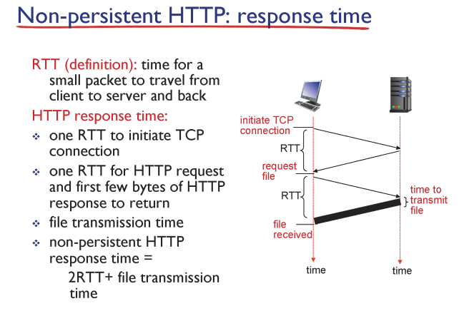

# 컴퓨터 네트워크 기본 02

```
한양대학교 이석복 교수님의 컴퓨터네트워크 강의를 요약한 글임을 미리 밝힙니다. 문제가 될 경우 삭제 조치 하겠습니다.
```

## TOC

1. [Caravan analogy](#1-caravan-analogy)
2. [Create a network app](#2-create-a-network-app)
3. [Client-server architecture](#3-client-server-architecture)
4. [Processes communicating](#4-processes-communicating)
5. [Sockets](#5-sockets)
6. [앱이 필요로 하는 전송 서비스 요구 사항](#6-앱이-필요로-하는-전송-서비스-요구-사항)
7. [Internet apps : application, transport protocols](#7-internet-apps--application-transport-protocols)
8. [Web and HTTP](#8-web-and-http)
9. [HTTP overview](#9-http-overview)
10. [HTTP connections](#10-http-connections)
11. [Non-persistent HTTP](#11-non-persistent-http)
12. [Non-persistent HTTP: response time](#12-non-persistent-http-response-time)

---

## 1. Caravan analogy

고속도로 상황의 비유해서 지연을 이해하기

<p align ="cetner">

</p>

- 차량 10대는 한꺼번에 다녀야한다. (패킷과 유사 : 10비트 패킷)
- 차는 시속 100km로 달린다. Propagation delay(전파 지연)
- 모든 차량이 첫 라우터(톨게이트)를 지나가는 순간까지의 걸린 시간
  은 Transmission delay(전송 지연)
- Trasmission 딜레이는 라우터가 패킷을 내보내는 데 필요한 시간이다.
- 위 예시에서 모든 차량이 톨게이트를 나오는 시간은 120초

## 2. Create a network app

<p align ="center">

</p>

> 우리는 기본적으로 네트워크 앱을 개발할 때 Network core의 라우터를 신경쓸 필요가 없다. 우리의 네트워크 앱은 다른 End Systems들과의 Communication만 신경쓰면 된다. 왜냐하면 라우터들은 바보라서 네트워크 레이어까지만 지원하기 때문이다.

## 3. Client-server architecture

<p align ="center">

</p>

> 서버는 permanent한 IP 주소를 가져야 한다. 반면 클라이언트는 고정된 IP가 아니여도 괜찮다.

## 4. Processes communicating

<p align ="center">

</p>

- 호스트 안에서 실행중인 프로그램을 프로세스라고 한다.
- 같은 호스트 안에서 두개의 프로세스간의 통신을 하기 위해서는 inter-process commnication(defined by os)를 이용한다.
- 다른 호스트 환경에 존재하는 프로세스 간의 통신을 하기 위해서는 Message exchange를 사용한다.
- `client process`: 통신을 시작하는 프로세스
- `server process`: 통신 연결을 기다리는 프로세스

## 5. Sockets

<p align ="center">

</p>

- 프로세스들은 소켓을 통해서 메시지들을 보내거나 받는다.
- 다른 컴퓨터와 데이터를 통신하기 위한 인터페이스
- IP와 port를 이용해서 통신한다.

## 6. 앱이 필요로 하는 전송 서비스 요구 사항

<p align ="center">

</p>

> 전송 서비스에는 여러가지 요구 사항이 있을 수 있다. 전송 계층 프로토콜 TCP에서는 Data integrity만을 보장한다. 나머지는 어플리케이션 레이어에서 해결한다.

- `Data integrity` : 데이터가 유실되지 않고, 온전히 목적지까지 도달하는 것을 보장하는 것에 대한 요구사항
- `Timing` : 시간적인 요구사항, 적은 지연을 요구사항 예시로는 전화나 상호작용이 중요한 게임이 있다.
- `Throughput`: 처리량과 관련된 요구사항, 멀티미디어 어플리케이션이 예시다.
- `Security`: 보안과 관련된 요구사항

## 7. Internet apps : application, transport protocols

<p align ="center">

</p>

## 8. Web and HTTP

<p align ="center">

</p>

- `HTTP(hypertext transfer protocol)`는 웹 어플리케이션 레이어 프로토콜

- 클라이언트(대표적으로 브라우저)가 리퀘스트를 보내고 결과를 받을 때 HTTP 프로토콜을 사용해서 받는다. 또한 받은 Web object들을 화면에 표시한다.

- 반면 서버는 HTTP 프로토콜을 이용해서 Web object들을 클라이언트에게 보낸다.(Response)

## 9. HTTP overview

<p align ="center">

</p>
<p align ="center">

</p>

- HTTP는 TCP위에서 작동하는 어플리케이션 레이어 프로토콜이다.
- 클라이언트는 TCP 커넥션을 80번 포트를 이용해서 연다.
- 서버는 TCP 커넥션을 받는다.
- HTTP는 stateless
  - 이전의 클라이언트의 리퀘스트 정보를 유지하지 않는다.
  - 즉, 상태를 저장하지 않는다.

## 10. HTTP connections

<p align ="center">

</p>

> HTTP가 TCP 커넥션을 사용하는 방식에 따라서 두가지로 나뉘어 진다. TCP 커넥션을 유지시킬 것인가 아닌가에 따라 나뉘어 진다고 볼 수 있다. (TCP 커넥션 재사용 여부)

## 11. Non-persistent HTTP

<p align ="center">

</p>

<p align ="center">

</p>

> Non-persistent인 경우 서버의 응답 이후에 위 처럼 TCP 커넥션을 끊는다. 파일이 더 필요할 경우 TCP 커넥션을 다시 열고 리퀘스트를 전송해야한다. 현대의 HTTP는 persistent HTTP를 사용한다.

## 12. Non-persistent HTTP: response time

<p align ="center">

</p>
