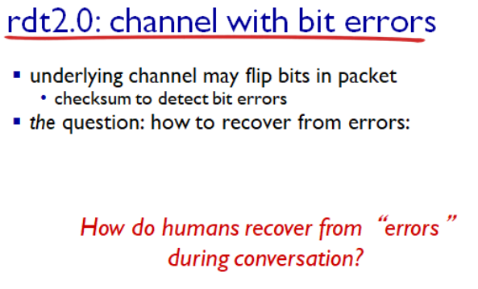

# 전송 계층(1)

```
한양대학교 이석복 교수님의 컴퓨터네트워크 강의를 요약한 글임을 미리 밝힙니다. 문제가 될 경우 삭제 조치 하겠습니다.
```

## TOC

1. [Transport services and protocols](#1-transport-services-and-protocols)
2. [Multiplexing, Demultiplexing](#2-multiplexingdemultiplexing)
3. [Connectionless demux : example](#3-connectionless-demux-example)
4. [Connection oriented demux: example](#4-connection-oriented-demux-example)
5. [UDP: segment header](#5-udp-segment-header)
6. [Principles of reliable data transfer](#6-principles-of-reliable-data-transfer)
7. [RDT: reliable data transfer](#7-rdt-reliable-data-transfer)
8. [RDT 1.0](#8-rdt-10)
9. [RDT 2.0 : chanel with bit errors](#9-rdt-20-chanel-with-bit-errors)
10. [RDT 2.1 : sender handles grabled ack/naks](#10-rdt-21-sender-handles-garbled-acknaks)
11. [RDT 2.2 : a nak free protocol ](#11-rdt-22-a-nak-free-protocol)
12. [RDT 3.0 : channels with errors and loss](#12-rdt-30-channels-with-errors-and-loss)
13. [RDT 3.0 in action](#13-rdt-30-in-action)

---

## 1. Transport services and protocols

> 전송 계층에는 TCP와 UDP가 있다. 전송 계층에서는 보내는 컴퓨터와 받는 컴퓨터의 TCP/UDP만 알 수 있다. 네트워크 내부는 네트워크 계층에서 다룬다.

<p align ="center">
    
</p>

- `인터넷` : IP 프로토콜을 사용하는 디바이스들의 연결

- 애플리케이션의 전송 단위는 메시지이다.
- 이 메시지는 소켓을 통해 내려오게 되고,
- 전송 계층의 전송 단위인 세그먼트 데이터 부분에 들어간다.
- 메시지를 편지, 세그먼트를 편지 봉투라고 생각하면 된다.
- 전송 계층의 전송 단위 : `세그먼트`, 애플리케이션 계층의 전송 단위 : `메시지`
- 우리가 편지 봉투에 수신인 정보와 같은 부가 정보를 기재하듯, 세그먼트도 헤더에 부가적인 설명이 들어간다.

> 전송 계층에서 관심이 있는 건 TCP/UDP 세그먼트를 상대방 TCP/UDP 쪽으로 전달하는 것이다.

## 2. Multiplexing/Demultiplexing

<p align ="center">
    
</p>

- `멀티 플렉싱` : 하나의 통신 채널로 여러개의 데이터를 동시에 보내는 것이다.
  여러 애플리케이션들이 전송계층으로 메세지를 전달하면 전송계층에서는 헤더를 붙여서 캡슐화하고 네트워크 계층으로 일렬로 내려보낸다.

- `디멀티플렉싱` : 수신 측 전송 계층에서 네트워크 계층에서 일렬로 올라온 데이터들을 헤더정보를 보고 알맞은 각 애플리케이션 소켓으로 전달하는 것이다.

> UDP와 TCP는 모두 멀티플렉싱과 디멀티플렉싱을 공통적으로 제공하지만 방식이 상이하다.

## 3. Connectionless demux: example

<p align ="center">
    
</p>

- udp는 connection less이다.
- 즉, 소켓과 소켓 사이의 1대 1 매핑 개념이 존재하지 않는다.

- 현재 UDP 세그먼트를 사용하고 있고 포트가 배정되어 있다.

- 헤더 부분의 필드로 src와 dst 포트 번호가 적힌다.

> UDP는 connection less이기 때문에 쌍이 맺어지지 않는다. 그렇기에 포트 번호를 바탕으로 올바른 소켓을 찾아간다.

## 4. Connection-oriented demux: example

<p align ="center">
    
</p>

> 고유한 포트 번호가 아님에도 불구하고 다 다른 소켓으로 가게 되는이유 는 TCP 소켓들은 sip, sport, dip, dport로 이루어져 있는데, 이 중 하나만 달라도 다른 소켓으로 인식되기 때문이다.

- TCP는 소켓과 소켓 사이에 커넥션이 존재한다. (connection-oriented)

- P3 소켓은 P4와 연결이 되어 있다. 즉, P3은 P4와만 소통을 하게 되는 것이다.

- 이 경우에는 UDP와 다르게 포트 번호가 따로 배정되지 않고, 모두 동일한 것을 알 수 있다.

- 이 경우에는 dport와 dip는 모두 동일하다. 다른 것은 sip와 sport이다. 그렇기 대문에 다른 소켓으로 인덱싱된다.

```
웹 서버를 예로 들어 설명하면,
웹 서버 프로세스는 80번에 assign된 소켓을 가지고 있고, connection이 되길 대기한다.
클라이언트로부터 tcp connection이 오면 accept call이 return 되면서 새로운 소켓 ID가 생성된다.
이렇게 생성된 소켓을 바탕으로 1대 1 매핑이 생성되는 것이다.
```

만약 A 머신에서 웹 브라우저 창 여러 개를 실행시킬 경우?

> sip, dip, dport는 다 같은데 sport가 다르기 때문에 다 다른 소켓으로 인식될 것이다.

## 5. UDP: segment header

<p align ="center">
    
</p>

헤더는 4개이다. ⇒ UDP의 기능이 많지 않다는 것을 의미한다.

data 부분에는 어플리케이션 계층의 메시지가 들어간다.

- `sport`와 `dport` : 각각 16비트로, 멀티플렉싱/디멀티플렉싱을 위해 존재
- `length` : data 길이를 의미하는 것으로, 다음 세그먼트의 시작 지점을 알기 위해 존재
- `checksum` : 전송 중 데이터 부분에 에러가 발생했을 경우, 에러 발생 유무 판단을 위해 존재(ex. 패리티 비트)

  - UDP는 에러 detection을 해준다는 것을 의미
  - UDP 측에서 디멀티플렉싱으로 올리기 전에 checksum을 확인해서 에러가 있으면 드롭 시킨다.

- 이때, data가 진짜 하고자 하는 메시지이고, 헤더는 아니기 때문에 작으면 작을수록 좋다.

- 헤더가 존재하지 않으면 작동을 하지 않기 때문에는 헤더에는 정말 핵심적인 내용만 담기게 된다.

- 헤더를 줄이는 역할을 하는 사람 : 프로토콜 디자이너

- 헤더에 무엇을 넣을 지를 정하고 난 후에 크기를 정해야 한다.

- 크기를 무제한으로 설정하면? ⇒ 편지 봉투가 엄청 커진다. 낭비가 발생한다.

**UDP 특징 :**

(1) 단순히 에러 체킹만 수행하고 에러가 존재하지 않으면 전달한다.

(2) 순서가 존재하지 않는다.

(3) 유실에 대해서는 따로 검사하지 않기에 유실이 발생하는 것은 잡을 수 없다.

## 6. Principles of reliable data transfer

<p align ="center">
    
</p>

- 위에는 응용 계층이고, 밑에는 전송 계층이다.

- 네트워크 프로세스가 서로 다른 머신에 있는 프로세스와 메시지 교환을 수행한다.

- 머신이 소켓을 통해 메시지를 내려보내면 TCP가 유실되지 않게 전송하는 것이 전체적인 과정이다.

이때 TCP 소켓을 통해 내려온 소켓이 1) `유실되지 않게`, 2) `에러 없이` 상대방의 소켓까지 전달되어야 한다.

실제로 네트워크를 보면 안산에서 캘리포니아로 TCP 전송을 해도 안산 - 대전 - 서울 이런 식으로 라우터를 건너건너 도착한다.

이때 라우터는 underline network로 reliable 하지 않다. (트래픽이 몰리면 큐에서 지연이 발생하다가 `loss`가 일어나기 때문에)

그렇지만 TCP 소켓을 사용하면 신뢰성 있게 전송이 가능하다고 했으니, 네트워크 사용자에게는 reliable한 것처럼 보여주어야 한다. 그럼 어떠한 프로토콜이 필요한지 알아보자.

## 7. RDT: Reliable data transfer

<p align ="center">
    
</p>

- 전송 계층에 RDT라는 신뢰성 보장을 위한 프로토콜이 있다고 생각하자.

- RDT는 메시지를 한 번 전송하고 상대방이 받은 것을 확인한 후, 다음 메시지를 전송한다.

> RDT를 통해서 1) `에러`, 2) `유실(loss)` 를 해결하면 reliable한 것을 보여줄 수 있다.

## 8. RDT 1.0

<p align ="center">
    
</p>

RDT 1.0은 에러도 없고 loss도 발생하지 않는 채널에서 그냥 주고 받기만 수행한다.

## 9. RDT 2.0: chanel with bit errors

<p align ="center">
    
</p>

- loss는 없지만 에러는 발생할 수 있는 상태에서의 RDT를 RDT 2.0이라고 한다.

- RDT2.0이 어떤 모습이어야 할 지 고민하기 위해서 전화 통화의 예를 보자.

- 전화 통화를 하면 전화 자체가 불안정하기 때문에 에러가 발생할 수 있다.

- 그렇지만 우리는 상대방이 잘 듣고 있는지 확인하는 과정을 통해서 제대로 된 의사소통을 할 수 있게 된다.

- 만약 상대방이 잘 못 들었다면 error detection이 된 것이다.
<p align ="center">
    
</p>

- 우리의 귀는 상대방의 대답을 바탕으로 `error detection`을 하고, 에러가 판별 되었을 경우에는 평소와 다른 `negative acknowledgements`를 준다.

- 즉, 에러가 없으면 `ACKs`를, 있으면 `NAKs`를 반환하게 되는 것이다.

- `ACKs`가 오게 되면 다음 메시지를 전송하고, `NAKs`가 오면 재전송을 한다.

<p align ="center">
    
</p>

위의 내용을 FSM으로 나타내면 위와 같다.

- 애플리케이션 데이터가 소켓을 타고 내려오면 그 데이터를 세그먼트에 담아서 보낸다.

- 이때 세그먼트의 헤더에 checksum이 들어가고 receiver는 checksum에 에러가 있으면 NAKs를 없으면 ACKs를 보낸다.

<p align ="center">
    
</p>

RDT 2.0 큰 문제가 있다.

checksum을 바탕으로 error dectection 후 피드백을 보내는데, 만약 피드백에서 에러가 난다면? ⇒ 중복으로 재전송 하게 될 수가 있다.

예를 들어 생각해보자. 메시지는 A A B B A B B A A A 이다.

- 한 글자씩 전송한다고 하면 A가 간 후, 에러 없이 잘 받았을 때 받는 쪽에서 ACKs를 보낼 것이다.

- 그런데 이때 ACKs가 오는 와중에 에러가 나면, ACKs인지 아닌지 알 수 없기 때문에 보내는 쪽에서 A를 한 번 더 보내게 된다.

- 이때 받는 쪽은 전송된 A까 다시 전송된 A인 것인지 아니면 새로운 A인 것인지 알 수가 없다.

- 그렇기 때문에 `sequence number`가 필요하게 되는 것이다.

- sequence number가 존재하면, A라는 데이터가 연달아 전송되었을 때 중복된 값인지 아닌지 알아낼 수 있다.(ex. A, 0번이 2번 보내졌으면 버림)

- 받는 쪽은 중복이든 아니든 피드백을 반드시 보내야 한다.

최종적으로 필요한 메커니즘은 아래와 같다.

(1) error detection

(2) feedback

(3) sequence number

> 헤더는 오버헤드여서 작아야 좋기 때문에 sequence number는 0과 1 두 가지만 사용한다. 0을 받았으면 1로, 1을 받았으면 0을 기다리는 방식이다. 이게 가능한 이유는 한 개 보내고 답이 올 때까지 다른 메시지가 전송되지 않기 때문이다.

## 10. RDT 2.1: sender, handles garbled ACK/NAKs

<p align ="center">
    
</p>

우리는 sequence number가 포함된 것을 RDT 2.1이라고 한다.

## 11. RDT: 2.2: a NAK-free protocol

<p align ="center">
    
</p>

RDT 2.2는 NAK와 ACK를 간소화하여 ACK만 사용하는 프로토콜이다.

만약 receiver가 0번까지 잘 받았고, 1번이 에러가 나면 Ack에 sequence number를 붙여서 전송한다.

> 즉, 1을 보냈을 때 답으로 ack 1이 와야 하는데 ack 0이 오면 에러가 발생했음을 깨닫고 재전송을 하게 되는 것이다.

## 12. RDT 3.0: channels with errors and loss

<p align ="center">
    
</p>

에러와 loss 모두 발생할 수 있는 상황에서의 프로토콜이다.

- 에러를 극복하는 메커니즘은 RDT2.x에서 마련되었기에 loss를 극복할 메커니즘만 추가되면 된다.

- loss가 발생한다는 것은 1) `메시지가 유실`되거나, 2) `피드백이 유실`되거나 이다.

- sender는 유실이 발생했음을 알기 위해 timer를 사용한다.

- 메시지를 보낸 후 일정 시간 동안 응답이 오지 않으면 액션을 취하도록 한다.

이때 문제는 타이머 값을 어떻게 정할 것인지이다.

(1) 타이머 값을 빠르게 세팅할 경우

- 장점 : 패킷 유실이 발생하면 빨리 재전송 가능
- 단점 : 라우터에서 지연이 발생해서 늦게 오는 건데, 또 보내는 경우에는 비효율적

(2) 타이머 값을 느리게 세팅할 경우

- 장점 : 지연 되었을 경우에, 쓸데없는 액션을 취하지 않아도 됨
- 단점 : loss가 발생했을 때의 대응이 느림

## 13. RDT 3.0 in action

<p align ="center">
    
</p>
<p align ="center">
    
</p>

(a) 유실 X

(b) 패킷 유실

(c) 피드백 유실

- rcv pkt 1을 두 번 받은 것을 알고 버린 후 ACK를 보냄

(d) 유실이 아닌데, 천천히 전송되어 timeout이 발생한 상황

- d는 타이머가 작게 세팅되어 있어서 중복 메시지가 발생하는 것이다.
