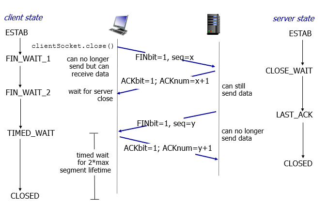
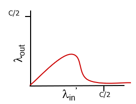

# 전송 계층(2)

```
한양대학교 이석복 교수님의 컴퓨터네트워크 강의를 요약한 글임을 미리 밝힙니다. 문제가 될 경우 삭제 조치 하겠습니다.
```

## TOC

1. [TCP](#1-tcp)
2. [TCP Segment](#2-tcp-segment)
3. [TCP timer](#3-tcp-timer)
4. [TCP reliable data transfer](#4-tcp-reliable-data-transfer)
5. [Flow control](#5-flow-control)
6. [TCP 3-way handshake](#6-tcp-3-way-handshake)
7. [Packet loss, Delay scenario](#7-packet-loss-delay-scenario)
8. [TCP congestion control](#8-tcp-congestion-control)
9. [TCP throughput](#9-tcp-throughput)
10. [TCP fairness](#10-tcp-fairness)

---

## 1. TCP

<p align="center">
    
</p>

**Pipelined protocols :** 현실적인 TCP 동작은 오른쪽처럼 일어난다. (한 번에 많이 보냄)

한 번에 많은 패킷이 동시에 나갔다가 그것에 대한 피드백을 일일이 처리하니까 RDP보다 복잡하다.

한 번에 일을 처리하는 파이프라인 방식의 일반적인 방법이 `go-Back-N`과 `selective repeat`이다

---

**tcp의 특징 :**

(1) `point-to-point` : 1대 1 대응 방식으로 연결이 맺어지면 맺어진 곳이랑만 통신을 한다.

(2) `reliable, in-order byte steam` : application message가 유실 없이 순서를 유지한 채로 보내지는 것

(3) `pipelined` : 메시지를 한 번에 많이 보낼 수 있는 것

(4) `full duplex data` : sender와 receiver가 고정된 것이 아닌, sender이자 receiver인 것

(5) `connection-oriented` : 초기에 handshake를 통해 연결을 맺는 것

(6) `flow controlled` : 상대방 머신의 성능에 맞게 보내는 것

---

**참고 :**

- 애플리케이션에서 내려오는 속도는 애플리케이션이 결정(소켓을 통해서 내려오는 속도는 프로세스 마음)

- 데이터와 세그먼트가 나가는 속도는 상대방 머신이 처리할 수 있는 속도에 맞게 tcp가 결정 후 보내주어야 함

- `condition control` : 네트워크가 꽉 막힌 상태에서 보내게 되면 상태만 악화됨

> 대표적인 것은 `reliable`, `flow controlled`, `condition control`이다.

## 2. TCP Segment

<p align="center">
    
</p>

> 데이터 부분에는 애플리케이션 메시지가 들어간다. UDP보다 제공하는 기능이 더 많기 때문에 UDP보다 헤더가 더 많다.

- `sequence number` : 받는 쪽에서 새로운 데이터인지, 중복된 데이터인지 구분하기 위해 트래킹 가능하도록 설정하는 값

- `acknowledgement number` : 잘 받았다는 의미로 보내는 ACK

---

**Sequence number :** Sequence number는 바이트 스트림 넘버로, 세그먼트 데이터의 첫번째 바이트가 숫자가 된다.

- A가 100바이트, B가 150 바이트, C가 200바이트, D가 70바이트라고 가정하자.

- 이때 A의 시퀀스 넘버는 0번이고, B의 시퀀스 넘버는 100번이다.

- B의 시퀀스 넘버가 100번이 되는 이유는 A가 0번부터 시작하고 100바이트를 차지하기 때문이다.

- 그럼 C의 시퀀스 넘버는 250번, D는 450번이 된다.

---

**acknowledgements :**
⇒ 99번까지는 문제 없이 잘 받았고 100번을 기다리고 있다는 뜻. cumulative ACK라고도 한다.

<p align="center">
    
</p>

- A가 Seq=42를 통해 42번 데이터를 전송한다. 그리고 ACK=79를 통해 78번까지는 잘 받았고 79번 데이터를 기다린다는 메시지를 B에게 전달한다.

- A의 메시지를 받은 B는 A에게 42번 데이터를 잘 받았다는 뜻으로 ACK=43을 주고, A가 요청한 79번 데이터를 Seq=79를 통해 전송한다.

## 3. TCP timer

tcp는 RTT를 이용해서 타이머를 설정한다.

- `RTT(Round trip delay)` : 통신에서 왕복 지연 또는 왕복 시간은 신호가 전송되는 데 걸리는 시간과 해당 신호가 수신되었음을 확인하는 데 걸리는 시간을 더한 것이다.

- **RTT 설정 방법 :** 갔다가 돌아오는 시간(RTT)을 측정해서 거기에 margin을 조금 붙이는 것

- `sampleRTT` : 세그먼트가 나갈 때부터 피드백이 올 때까지의 시간을 측정한 것

  - sampleRTT를 세그먼트 전송할 때마다 측정해야 함
  - sampleRTT의 문제

    - > 시퀀스 넘버 500번인 세그먼트를 보내면(S#500), 사이즈가 200일 때 ACK 700이 와야한다.(A#700) 만약 이때 피드백이 안 오면, S#500이 다시 전송된다. 그럼 나중에 도착할 A#700이 처음 S#500에 대한 것인지, 2번째 S#500에 대한 것인지 알 수 없다.
    - 그렇기 때문에 재전송은 sampleRTT에 포함하지 않는다.

    <p align="center">
        
    </p>

    sample RTT를 구하면 위의 그래프처럼 나온다.

    **한 번 맺어진 TCP 소켓에서 주고 받는 건데 매번 다른 이유** : 네트워크 환경이 다이나믹하게 바뀌고, 각 세그먼트가 겪는 큐잉 딜레이가 다르기 때문

    ⇒ 이런 상황이 발생해서 타이머 값을 세팅하기에는 적당하지 않다. 그래서 등장한 것이 `estimatedRTT`이다.

- `estimatedRTT` : 가중치를 두어서 측정하는 것으로, 가장 최근에 측정된 sampleRTT에 가중치를 매겨서 측정하는 방법

  - `estimatedRTT` = (1-a) \* EstimatedRTT + a \* SampleRTT (이때 a 값은 0.125)

- `timeout interval` : EstimatedRTT 값에 margin을 더한 것.

  - margin은 4\*DevRTT로 구한다.
    <p align="center">
        
    </p>
  - 재전송은 포함시키지 않는다.
  - timeout, 타이머 값이 매번 업데이트 되기 때문에 네트워크 상황에 따라 굉장히 유연하게 변한다.

## 4. TCP reliable data transfer

> 한 쌍의 소켓이 TCP 커넥션을 맺으면 각 소켓에 해당하는 TCP 측에는 send 버퍼와 receiver 버퍼가 생성된다.

- `send buffer` : 애플리케이션이 소켓을 통해서 전송하는 속도와 tcp가 전송하는 속도가 다르기 때문에 사용한다.

  - window size 만큼만 한 번에 전송이 가능하다.ex) window size가 1000바이트면 send buffer에서 1000바이트만 한 번에 보낼 수 있다.세그먼트가 #0, #200, #400, #600, #800이라고 하면 5개가 한 번에 보내질 수 있다.
  - 즉, 시퀀스 넘버로 치면 0번부터 999번까지만 나갈 수 있는 것.

- `receiver buffer` : send buffer에서 보낸 세그먼트가 들어가는 곳

---

`send`와 `receiver가` 주고 받는 일반적인 경우를 생각해보자.

(1) send에는 #0, #200, #400, #600, #800가 있고 #0을 전송. 이때 타이머를 실행한다.

(2) receiver는 0을 잘 받았으면 ACK #200을 전송 → acknowledgement nubmer에 해당하는 부분

(3) 타이머가 끝나기 전에 ACK가 오면, send base값을 0에서 200으로 바꿈. 타이머도 send base에 맞물리게 됨.

(4) receiver는 잘 받았으니까 0을 애플리케이션 계층으로 보낸다.

---

`유실이 발생한 경우 `

(1) send에는 #200, #400, #600, #800, #1000이 있고, window size에 따라 모두 전송하고 삭제

(2) #400이 유실되어 receiver에는 #200, #600, #800, #1000이 온다.

(3) receiver는 #200을 잘 받았으니 ACK #400 전송

(4) send에서는 ACK #400을 보고 send base를 400으로 변경

(5) receiver는 400을 받지 못했으니 600이 있다고 하더라도 ACK #400을 전송

(6) sender는 이미 400을 지운 상태라서 할 수 있는 상황이 없음.

> 그래서 send buffer는 완벽하게 전송 되었는지 확인한 후에 삭제를 진행하여야 한다. send buffer의 목적이 재전송이 되는 것이다. receiver buffer는 상대방이 보낸 메시지가 순서대로 왔는지, 유실은 없었는지, 지연이 없는지를 확인하기 위한 장치이다. receiver buffer를 통해 in-order를 구현한다.

---

`유실 되었는데, 타이머가 발생한다면`

- 타이머 내에 원하는 답이 오지 않으면, 타이머에 물린 값이 전송됨.

- 예를들어, #400이 유실되었으면, #400을 전송한다.

- 이때 400이 들어오면서, 애플리케이션으로 올라가지 못했던 패킷들도 한 번에 올라가게 된다.

- 그 다음 ACK 1400을 받으면(window size가 1000이니까 400-1399까지 전송된 상태) send base가 한 번에 1400으로 변경된다.

- 이렇게 TCP에서는 packet loss를 타이머를 통해 처리한다.

- 타이머는 소켓 당 하나씩 들어있고 맨 앞에 있는 세그먼트에 물려 놓는다.

- 이때 최적화 관점에서 아쉬운 점은, timer가 expire되는 시간이 너무 느리다는 것이다.

- 빠르게 유실을 판단할 수 있게 하기 위해 똑같은 ACK가 오는 횟수를 구하게 되었다.

- timer가 expire 되지 않아도 똑같은 ACK를 4번째 받았을 경우 재전송을 한다. `(solution)`

그림으로 나타내면 아래와 같다.

> read 콜이 있으면 리시버 퍼버에 있는 데이터를 가져가고, write 콜이 있으면 센드 버퍼에 데이터를 보낸다.

<p align="center">
    
</p>

## 5. Flow control

> 상대방이 receive 가능한 정도를 알고 그 만큼만 데이터를 보내는 것이다.

- tcp send에서는 read 속도로 보내야 터지지 않는다.

- 리시버 버퍼에 남아있는 빈 공간을 리시버 윈도우(RWND)라고 하고 이 값을 receiver window 헤더에 담아서 보낸다. ⇒ 어느 정도 크기까지 가능한 지를 알 수 있다.

- 이렇게 하면 오버플로우가 발생하지 않는다.

---

> `rwnd = 0` 일 경우 send는 rwnd가 0이기 때문에 보내지 않는다.

- 이때 read call이 발생해서 rwnd가 300이 되었을 경우, 세그먼트가 나갈 수 있는 경우는 2가지가 있다.

```
(1) send에서 write해서 보낼 게 있거나
(2) send에서 segment가 들어와서 ack를 줄 때
```

- (2)번은 rwnd=0을 보내줬기 때문에 오지 않는다. 그리고 write를 하고 있지 않다면 보낼 게 없으니 세그먼트가 나가지 않는다.

- 이때 deadlock이 발생한다. deadlock을 해결하기 위해서 주기적으로 아주 작은 데이터 세그먼트를 보낸다.

- 정확히 얘기하면 RWND=0이라고 보고되었을 때, send는 flow packet이라고 하는 데이터 1바이트, 헤더 40바이트의 41바이트 패킷을 주기적으로 보낸다. (2)의 경우를 만족하는 방법이다.

---

**세그먼트 사이즈 :**

1. 세그먼트 사이즈는 크면 좋을까 작으면 좋을까?

> 데이터의 크기와 상관없이 헤더는 고정되어 있는데, 세그먼트 사이즈가 커질 수록 오버헤드가 줄어든다. 그렇기 때문에 가능한 최대 크기로 만들어서 보내는 것이 좋다.

2. 그런데 만약 write를 엄청 드물게 혹은 조금씩 한다면?

> 정답은 없지만 엔지니어적 관점에서 첫 번째 세그먼트는 얼마가 됐든 무조건 담아서 보낸다. 그런 다음 보낸 값에 대한 피드백에 오면 피드백이 온 시점까지 축적된 것을 보낸다. 만약 피드백이 오기 전에 max가 되면 피드백을 기다리지 않고 보냄.

3. receiver 입장에서는 어떨까?

> 빈 공간이 1바이트 남았으면 RWND를 1로 설정해서 보냄. send는 1만 보내는 비효율적인 세그먼트가 발생함. 그래서 빈 공간이 mas seg보다 작을 때 그냥 0으로 설정해서 보낸다. (david clark이 제안한 것)

4. mss 란?

> 최대 세그먼트 사이즈를 의미한다.

5. 세그먼트 사이즈 규칙

- write 속도가 RTT보다 빠르면 세그먼트 사이즈가 커진다.
- write 속도가 RTT보다 느리면 세그먼트 사이즈가 작아진다.

## 6. TCP 3-way handshake

> 실제 데이터가 이동하는 게 아닌 최초의 연결 과정에서 tcp 는 3-way handshake 방식을 사용한다.

<p align="center">
    
</p>

2-way로 안 하는 이유 : 보내는 쪽은 확인이 가능한데, 받는 쪽인 확인이 불가하기 때문이다.

---

**3-way handshake**

<p align="center">
    
</p>

- 왼쪽이 클라이언트, 오른쪽이 서버.

- 제일 처음은 `TCP SYN Message`로, 헤더 부분의 필드만 채워져서 간다.

- `TCP SYN`일 경우에는 segment 헤더의 S가 1로 세팅된다.

- `SYN/ACK`일 경우에는 segment 헤더의 S와 A가 1로 세팅된다.

- ACK일 경우에에는 A만 1로 세팅된다.

- 3-way에서 중요한 것은 `SYN`과 `SYN/ACK`가 컨트롤 메시지이기 때문에 헤더만 나가고, `SYN/ACK`에 대한 ACK는 보통 ACK 메시지이기 때문에 보내고자 하는 메시지를 담아서 보낼 수 있다는 것이다.

---

**4-way handshake** : connection close 과정이다.

<p align="center">
    
</p>

- 끝낼 때는 F 플래그(Finish)를 1로 세팅해서 보낸다.

- 이때 FIN 보내고 ACK 보냈음에도 OS에서는 버퍼를 바로 해제 시키지 않고 보관한다.
  - ⇒ FIN에 대한 ACK가 유실되었을 경우에 ACK를 버퍼에서 해제 시킨 상태라면, 서버는 계속 FIN을 보내게 되는데 이 상황을 막기 위해서다.

## 7. Packet Loss, Delay Scenario

scenario 1

<p align="center">
    
</p>

- 중간에 라우터가 있는데, 라우터의 큐는 무제한이다.

- 재전송은 없다고 할 때 보낸 속도를 늘리면 받는 속도가 늘어나지만 동시에 딜레이도 늘어난다.

scenario 2

<p align="center">
    
</p>

- 큐가 있고 재전송이 있을 경우, 애플리케이션에서 보내는 데이터 양보다 TCP에서 보내는 양이 더 많다.

- 라우터의 빈 공간이 있는 지 없는 지를 내가 안다고 가정하고 동작을 시키면, 빈 공간이 있을 때만 보낼 테니까 패킷 로스는 없다.

- 이때 보내는 양을 늘리면 받는 양도 늘어날 것이다.
  - 하지만 빈 공간의 유무를 안다고 가정한 것이 비현실적이다.

이때의 그래프는 아래와 같다.

<p align="center">
    
</p>

scenario 3

<p align="center">
    
</p>

호스트에서 보내는 양을 늘리면

<p align="center">
    
</p>

- 처음에 막힌 게 없으니까 쭉 올라가지만, 모든 애들이 보내는 속도를 극단적으로 늘리면 자기 앞에 있는 라우터를 한 호스트가 다 차지하게 된다.

- 즉, A 앞에 있는 라우터 A가 차지하고, B 앞에 있는 라우터는 B가 다 차지하게 된다.

> 업스트림 라우터 : 출발지 근처에 있는 라우터

- 업스트림 라우터에서 다운스트림 라우터로 가는 건데 다운스트림 라우터에서 패킷이 드롭되면, 거기까지 도달하는데 사용된 네트워크 자원이 모두 낭비된다. 심지어 다시 보내야 한다.

- 그래서 위의 그래프처럼 어느 순간을 기점으로 떨어지게 돼서 살아서 도달하는 것은 없게 된다.

- 따라서, 라우터가 감당할 정도로만 보내야 한다. 많이 보내면 보낼 수록 못 받게 된다.

## 8. TCP congestion control

> 위에서 언급한 라우터가 감당 가능한 정도를 알아내기 위해서는 막혔는지 안 막혔는지 확인을 할 수 있어야 한다.

- `addictive increase`: loss가 발견될 때까지 cwnd를 늘리는 것

- `multiplicative decrease`: loss 이후로 cwnd 값을 반으로 줄이는 것

<p align="center">
    
</p>

- y축이 cwnd(컨디션 윈도우 사이즈)이다.

- `cwnd`는 네트워크가 받아들일 수 있는 네트워크의 양이다.

- 최초로 받아들인 윈도우 사이즈(send buffer의)는 receive와 condition 2가지 중 작은 값으로 설정된다. (리시버와 네트워크)

> 늘리는 것은 조심스럽게 하고 문제가 생겼을 때는 크게 감소시킨다.

<p align="center">
    
</p>

위의 그림처럼 처음에는 하나로 시작하는 대신 기하급수적으로 증가 시킨다.

<p align="center">
    
</p>

- TCP 내부에서는 TCP에 대한 `threshold`를 설정하여 8이 넘어가면 슬로우 차트가 아니라 리니어 차트가 된다.
  -⇒ 경험적으로 이 이후부터는 컨디션이 발생할 위험지역이라는 것이기 때문에 리니어 차트로 변경

- 리니어 부분을 congestion avoidence라고 한다.

- 최대치로 보내기 위해 congestion이 발생하기 전까지 증가한다.

loss는 네트워크에 혼선이 발생한 것으로 loss가 발생하면 cwnd 값을 줄여야 한다. 이때 loss라고 판단하게 되는 근거는 1) `timer expire`, 2) `duplicate acks`가 있다. 1번의 경우가 더 혼잡하다. 더 많이 발생하는 것은 2번이다.

1번이 더 혼잡하기 때문에 1번은 값을 완전히 하락(초기값)시키고, 2번은 값의 1/2을 취한다.

## 9. TCP throughput

> TCP를 사용할 경우 나가는 속도는 네트워크가 결정한다

thorughput은 네트워크 상황마다 다르기 때문에 bandwidth가 뭐냐고 물어보면 대답하기가 어렵다.

<p align="center">
    
</p>

- W는 CWND이다.
- 한 번에 보내고, 피드백이 돌아오면 다시 그만큼 보낼 수 있다.
- 단위 시간당 보내는 양이 throughput이니까 그걸 윈도우 사이즈라고 볼 수 있다.

> 만약 UDP를 사용한다면? UDP의 전송 속도는 어플리케이션에 달려있다. 소켓을 열고 10기가 바이트 초당 보내면 네트워크도 설정한대로 보내게 된다.

> TCP에 congestion control이 없다면? 내가 보내도 상대방은 못 받을 수 있다. 리시버가 감당 가능한 양을 넘게 되면, 보내기만 하게 된다.

## 10. TCP Fairness

<p align="center">
    
</p>

> host1의 윈도우 사이즈와 2의 윈도우 사이즈가 r/2씩 나오면 공평하다. ⇒ 실제로도 그렇다.

<p align="center">
    
</p>

가장 아래에서부터 시작했다고 가정하자.

- 가장 아래에서는 남으니까 전송속도를 늘린다.

- 그럼 loss가 발생하니까 다시 줄인다.

- 이 과정을 반복하면 TCP를 사용할 때 1/n만큼 자원을 사용하게 된다.

> 이게 바로 네트워크를 혼잡하게 하지 않으면서 최대한으로 자원을 사용할 수 있는 방법이다.
