# 네트워크 계층

```
한양대학교 이석복 교수님의 컴퓨터네트워크 강의를 요약한 글임을 미리 밝힙니다. 문제가 될 경우 삭제 조치 하겠습니다.
```

## TOC

0. [수식정리](#수식-정리)
1. [Router](#1-router)
2. [Router architecture](#2-router-architecture)
3. [IP](#3-ip)
4. [Subnets](#4-subnets)
5. [NAT](#5-nat)
6. [DHCP(Dynamic Host Configuration Protocol)](#6-dhcpdynamic-host-configuration-protocol)
7. [IP fragmentation](#7-ip-fragmentation)
8. [Dijkstra's algorithm](#8-dijkstras-algorithm-for-routing)
9. [Distance vector algorithm](#9-distance-vector-algorithm)
10. [Interconnected Ases](#10-interconnected-ases)
11. [Relationships between networks](#11-relationships-between-networks)

---

## 수식 정리

<p align="center">
    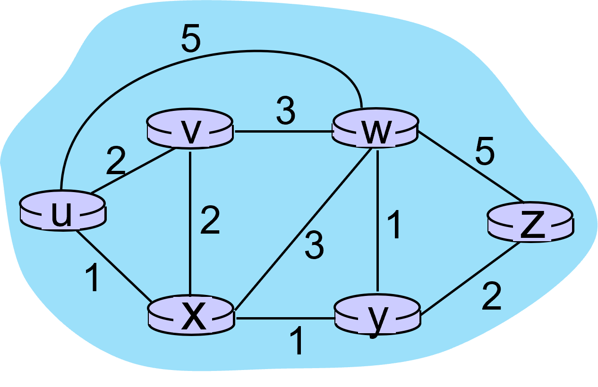
</p>

```
c(a,b): cost of direct link connecting a and b
             e.g., c(w,z)= 5, c(u,z) = infinity
```

- c(x,y): direct link cost from node x to y; = ∞ if not direct neighbors

- D(v): 소스에서 목적지 v 까지의 최소 비용 경로 비용의 현재 추정값

- p(v): 소스에서 v까지의 경로를 가기위한 선행 노드

- N': 최소 비용 경로가 명확하게 알려진 노드 집합

## 1. Router

> 네트워크 계층의 대표적인 장비는 라우터다. 또한 대표적인 프로토콜로서 IP가 중요하다.

IP가 중요한 이유는 현재 인터넷은 TCP/IP 기반으로, 라우터들이 IP 패킷을 씌운 정보만 이해해서 넘기기 때문이다.

**라우터가 수행하는 두 가지 기능 :**

(1) `forwarding` :들어온 패킷을 포워딩 테이블을 참조해서 올바른 위치로 보내주는 것

- 포워딩 자체는 단순하지만, 이슈가 발생하는 이유는 빠르게 해줘야 하기 때문에 로스가 생김

<p align="center">
    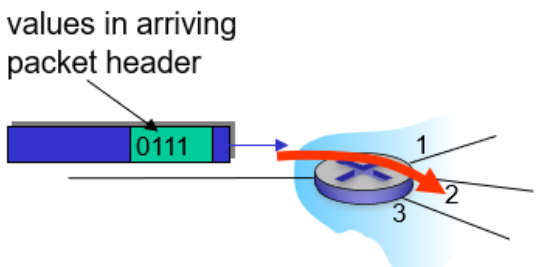
</p>

- 이때 포워딩 테이블은 destination 주소가 엔트리로 들어가면 너무 커지기 때문에, 엔트리는 주소 range가 들어간다. (아래의 예시 확인)
<p align="center">
    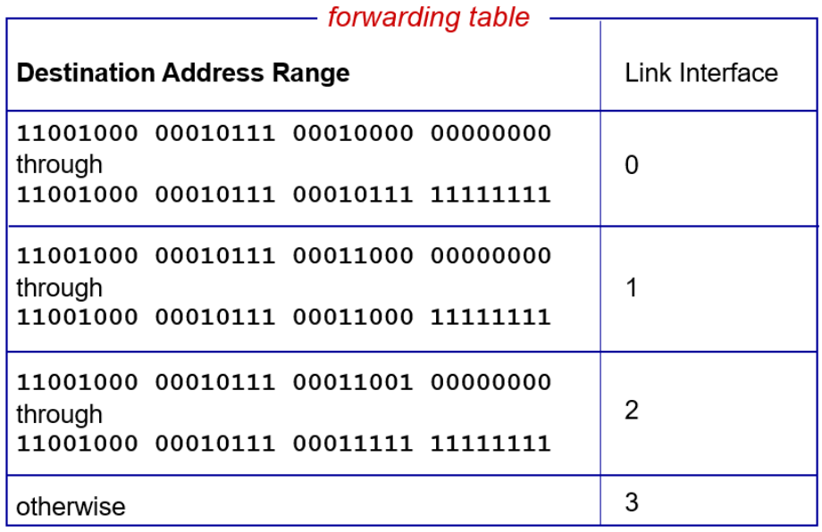
</p>

- 더 현실적으로 표현하면 아래와 같다.
  - 이때 \* 표시를 통해서 범위를 저장하기 때문에 여러 개에 매칭될 수 있다.
  - 그럼 가장 길게 prefix가 매칭되는 걸 찾아서 그곳으로 포워딩을 하면 된다.

<p align="center">
    
</p>

예를 들자면

- ex 1) DA: 11001000 00010111 00010110 10100001

  - 이 경우에는 빨간색으로 표시된 부분이 0번과 매칭 되기 때문에 0번으로 보내면 된다.

- ex 2) DA: 11001000 00010111 00011000 10101010

  - 이 경우에는 1번, 2번 모두에 매칭된다.

  - 그런데 `longest prefix matching`을 선택해야 하니까, 1번으로 보내면 된다.

> 1번을 안산시 상록구로, 2번을 안산시로 생각한다면, 당연히 1번이 더 정확하다.

---

(2) `routing` : 포워딩 테이블을 채우는 과정이다.

- 인터넷에 존재하는 IP 라우터들은 badnwidth나 delay, loss를 전혀 보장해주지 않는다.
- 그렇기 때문에 전송 계층에서 이를 보장해준다.

## 2. Router architecture

<p align="center">
    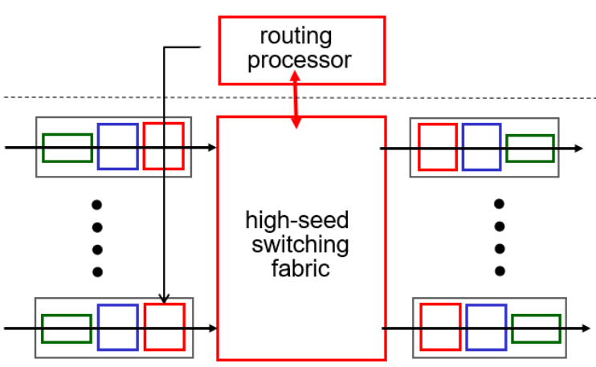
</p>

- 라우터는 위와 같이 input으로 들어온 것을 올바른 output으로 옮겨주는 것이다.

- 포워딩 테이블이 만들어질 때 포워딩 테이블은 각 input 포트에 독립적으로 저장된다.

---

**input port 구조**

<p align="center">
    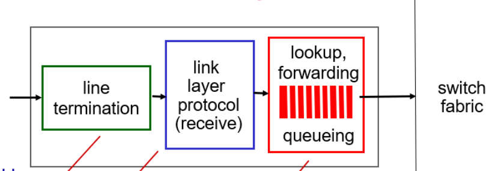
</p>

- 들어오는 것들은 독립적으로 처리가 된다.

- 포워딩 연산(매칭하는 작업)보다 패킷이 들어오는 속도가 더 빠를 경우를 대비하여 queue가 존재한다.

- 이때 queue에 저장할 수 없을 정도로 많은 패킷이 들어오면 loss가 발생하고, 연산 처리 속도보다 들어오는 속도가 빠르면 delay가 발생한다.

- Output port도 동일하게 되어 있다.

## 3. IP

> IP 주소는 머신의 네트워크 인터페이스를 지칭한다.

- 보통은 인터페이스가 하나이기 때문에 IP가 하나라고 생각하는데, 인터페이스가 여러 개 있으면 IP가 여러 개가 된다.

- IP가 여러 개, 즉 인터페이스가 여러 개인 디바이스가 라우터이다.

---

**IP datagram format :**

<p align="center">
    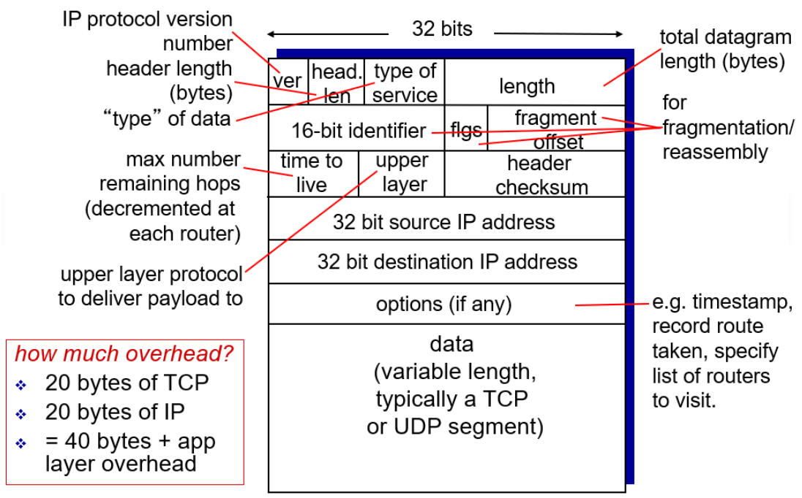
</p>

- IP 패킷의 최종 형태는 IP 헤더 - TCP 헤더 - 애플리케이션 메시지이다.

- IP 헤더와 TCP 헤더는 각각 20바이트로, 이 부분은 오버헤드가 된다.

- `TTL(time to live)` : 패킷이 무한 루프에 빠지지 않도록 패킷에 수명을 주어 TTL에 기재된 숫자가 0이 되면 패킷을 버리는 것

- `Upper layer` : IP 패킷의 데이터에 담긴 것을 상위 레이어에 올려줄 때, TCP인지 UDP인지 아니면 다른 것인지 구분해서 올바르게 보내줄 수 있도록 하는 것.

```
IP 패킷을 보다 보면 딱 40바이트 크기의 패킷이 있다.

⇒ 우리가 영화 같은 것을 다운로드 할 때 서버에서 데이터가 온다. 이때 우리는 다운로드가 목적이기 때문에 보낼 게 없는데 잘 받고 있다는 TCP feedback을 전송해주어야 한다. 이 TCP ack 용도로 40바이트가 날라간다.
```

---

**IP 주소의 배정 방식 :**

(1) 유효한 IP 주소 32비트를 누가 가지고 있다가 필요한 사용자가 생기면 배정해주는 방식

- `단점`: 사용자가 늘어남에 따라 이용이 힘들어진다.

- 필요할 때 마다 주게 되면 배정은 편하지만, 라우터가 포워딩 할 때 엔트리 개수가 커지기 때문에(모든 주소에 대해서 어느 방향으로 가야 할 지 써야 하기 때문에) 매칭이 오래 걸린다.

> 즉, `scalability` 문제가 생긴다. 이를 해결하기 위해서는 계층화를 해야 한다.

(2) 계층화를 통해 배정해주는 방식

- 계층화를 한다는 건 IP 32비트를 통째로 사용하기 보다는 계층을 나누어서 앞의 몇 비트는 어디 네트워크에 속하는지(네트워크 ID == prefix == subnet ID), 뒤의 몇 비트는 어떤 호스트에 속하는지(호스트 ID)로 나눈다는 것이다.
- 즉, 위에서 앞부분 24비트를 IP로 쓰고, 뒤에 8비트를 호스트로 쓴다.
- 이걸 사람이 보기 쉽게 / 로 표현한다.

<p align="center">
    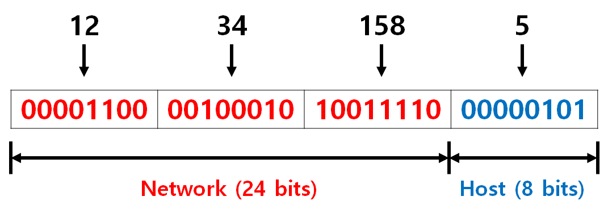
</p>

계층화 장점 :

- 같은 네트워크에 속하는 애들은 네트워크 ID가 같기 때문에 포워딩 테이블이 간단해진다.
- 포워딩 테이블이 간단해지기 때문에 매칭도 빠르다.
- 새로운 호스트가 등장해도 포워딩 테이블에 추가할 필요 없이 배정해주면 된다.

서브넷 마스크 :

- 머신들이 이해하기 어렵다. 그래서 머신들이 이해하기 쉽게 서브넷 마스크를 사용한다.

- address와 END 연산 수행해서 어느 서브넷에 있는지 확인
<p align="center">
    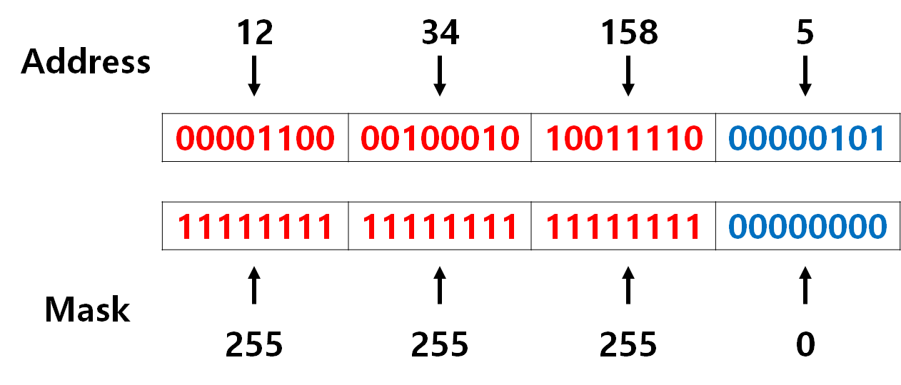
</p>

네트워크 ID와 호스트 ID :

```
네트워크 ID == 식별자 호스트 ID == 사용할 수 있는 호스트 개수(만약 8비트라면 2^8개 사용 가능)
```

- 만약 호스트 1000개가 필요하면? 즉, IP가 10000개가 필요하다면

  ⇒ preifx는 8로 설정하고, 나머지를 host로 설정한다.

- 이때는 그럼 전 세계에서 네트워크가 2^8개만 존재할 수 있기 때문에 모자라다. 즉, 기관의 수를 감당할 수가 없다는 것.

  ⇒ 그래서 결국 고정시키지 않고 가변적인 방식을 사용한다.

- 또한, 한 호스트에 맞추어서 10000개를 배정했을 경우 다른 호스트는 그 정도까지는 필요하지 않아서 낭비가 발생하기도 한다.

- 네트워크 ID 부분이 포워딩 테이블의 엔트리가 된다.

- Prefix의 개수가 네트워크 전체에 존재하는 기관의 숫자와 동일하다고 생각하자.

- 그럼 기관이 많이 존재하기 때문에 이를 관리하는 기구가 지역별로 존재하고 중앙에서 prefix를 준다.
- 즉, 기관이 기관에 존재하고 있는 인터넷 사업자들이 필요할 때마다 배분해준다.

## 4. Subnets

<p align="center">
    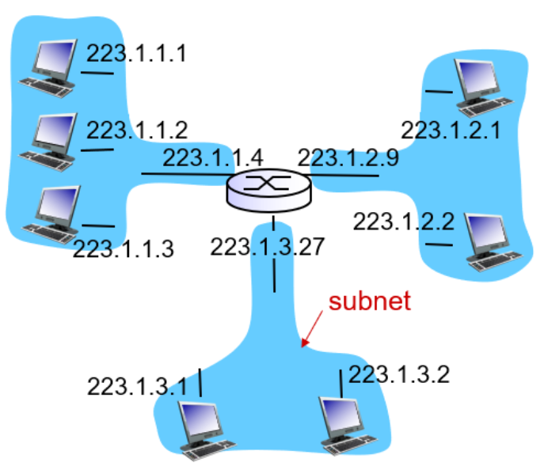
</p>

- 같은 네트워크 ID를 가진 인터페이스의 집합

- 즉, 라우터를 거치지 않고 직접적으로 접근할 수 있는 인터페이스의 집합을 의미한다.

- 위처럼 223.1.3의 경우 223.1.3.*에 해당하는 인터페이스에는 라우터를 거치지 않고 접근 가능하지만, 223.1.1.*에 해당하는 인터페이스에는 라우터를 거쳐야만 접근할 수 있다.

- 이때 라우터는 여러 개의 서브넷에 속해있는 중간자이다.

<p align="center">
    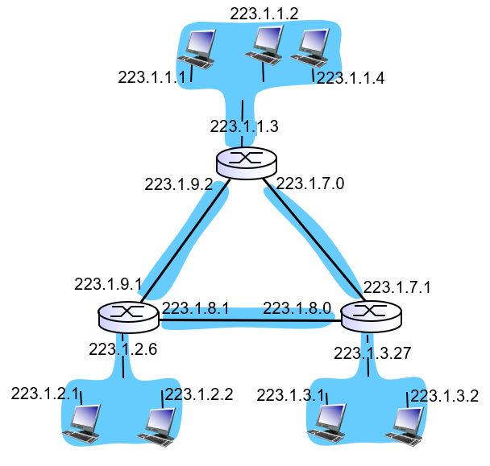
</p>

- 이 경우에는 6개의 서브넷이 존재한다.

## 5. NAT

- 인터넷이 상업화됨에 따라 공인IP가 부족해지기 시작했다.

- 이에 90년대 중반에 IP 주소 필드가 128비트인 IPv6가 등장했다.

- 그런데 아직까지 IPv4를 사용하고 있다.

  - 왜냐하면 IPv6로 갈아탄다는 건, 라우터를 다 바꿔야 한다는 뜻인데 (라우터가 현재 IPv4 기준으로 되어 있으니까) 이는 쉽지 않다.

  - 라우터를 바꾸는데 돈이 들기도 하고, 만약 라우터를 나만 변경한다면 IPv6에서 IPv4로 변경해주는 작업이 또 필요하기 때문이다.

> 이러한 문제를 해결하기 위해 등장한 것이 NAT이다.

<p align="center">
    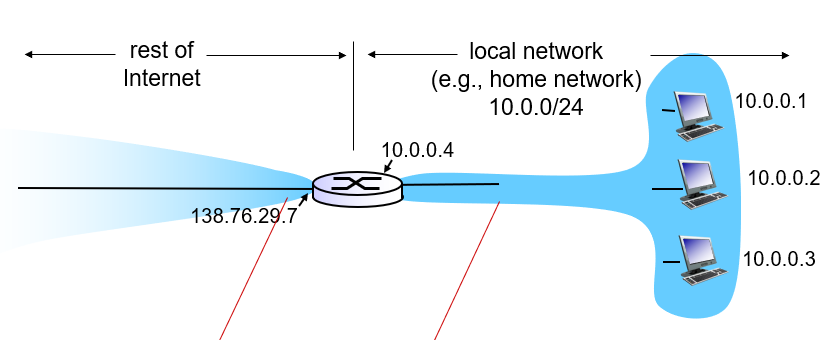
</p>

NAT를 사용하면, 위와 같이 구성된다.

- 138.76.29.7은 네트워크 외부와 통신하기 위한 공인 IP이고,

- 10.0.0.\*의 경우에는 네트워크 내부에서 통신하기 위한 사설IP이다.

- 사설 IP는 네트워크 내부에서만 유효하다. 즉, 10.0.0.1 패킷이 외부로 나가게 되면 돌아오지 못한다.

- 그렇기 때문에 나갈 때 gateway의 IP주소로 바꿔주어야 한다.

- 돌아올 때도 마찬가지로 게이트웨이 주소로 들어온다.

<p align="center">
    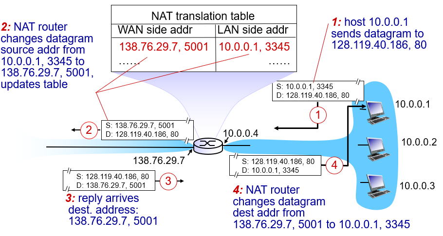
</p>

---

`1번 패킷` :

- 80으로 가는 것을 보아 웹 서버로 가는 패킷이고 웹 서버에 40바이트짜리 TCP SYN, TCP handshake를 요청하는 것이다.

- source는 지금 내부에서만 유효하다.

---

`2번 패킷` :

- source 주소를 외부에서도 유효한 주소로 바꿔준다.

---

`3번 패킷` :

- 2번에서 S와 D가 변경되어서 돌아온다.

- 목적지 주소와 NAT translation table을 비교하여 맞는 것으로 변경해준다.

- 즉, D가 138.76.29.7, 5001에 해당되는 LAN side addr이 10.0.0.1, 3345이기 때문에 이걸로 변경해준다.

---

`4번 패킷` :

- 3번에서 테이블을 바탕으로 바뀐 값이 D에 들어간다.

- 이때, IP 주소 뿐만 아니라 포트 번호도 바뀌었는데, 이는 겹치지 않는 포트번호를 배정해주기 위함이다.

---

**NAT의 부작용 :**

**(1) 내부에서 서버를 운영하면 접근이 불가하다.**

- 즉, 10.0.0.3:7777이라는 서버를 운영할 경우, 다른 네트워크에서는 접근할 수 없다.

- gateway IP 주소를 알려준다고 해도 gwIP:7777로 접속하면 라우터까지만 올 수 있다.

- 7777이 안 되는 이유 : 매핑 엔트리가 nat translaction table에 `나갈 때` 적히기 때문에 80으로 들어오면 7777로 변환되도록 미리 적어두어야 한다.
  - 하지만 미리 적어두기란 쉽지 않다.
  - 이를 해결해주기 위해서는 홀 펀칭을 사용해야 한다.

> 홀 펀칭이란 방화벽 뒤에 있거나 NAT를 사용하는 라우터 뒤에 있는 두 당사자 간의 직접 연결을 설정하는 기술이다.

**(2) 디자인상으로 지저분하다.**

- NAT는 IP 패킷도 보고, port 번호도 보고 TCP 안에 있는 정보도 보고, 즉 계층화가 되어 있음에도 불구하고 다른 계층의 일을 한다.

- 이렇게 되면 외부에서 패킷이 들어올 때 Destination IP는 의미가 없다.

- 포트번호를 보고 판단하기 때문에. 그럼 호스트를 구별할 때 IP가 사용되어야 하는데 port로 구별하기 때문에 서버 운영이 안 된다.

## 6. DHCP(Dynamic Host Configuration Protocol)

<p align="center">
    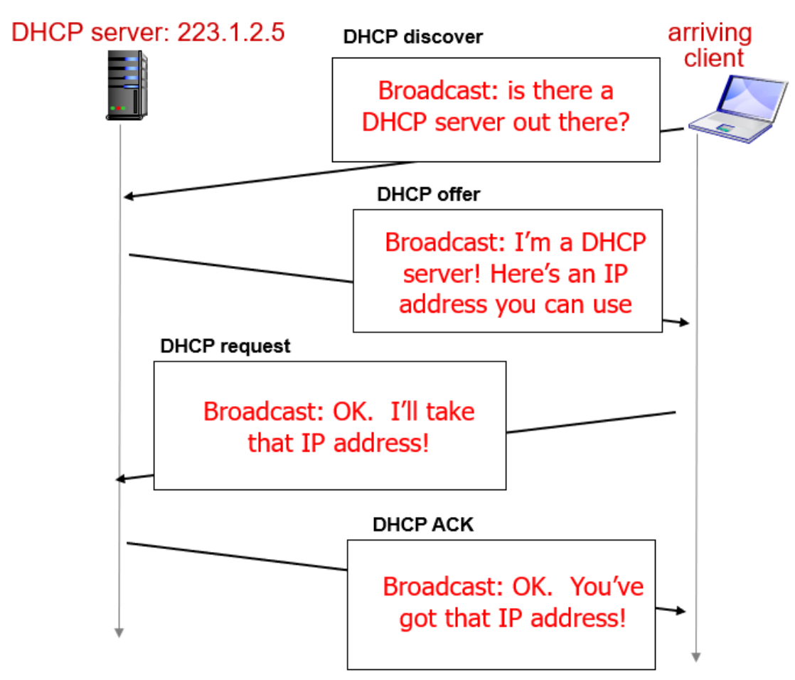
</p>

- IP 주소를 배정해주는 프로토콜이다.

- DHCP server는 67로, client는 68로 고정되어 있다.

<p align="center">
    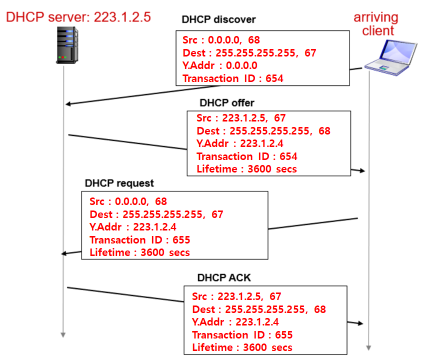
</p>

---

**(1) DHCP discover**

- src는 0.0.0.0:68로, dest는 255.255.255.255:67로 보낸다.

- 67로 보내기 때문에 ip가 255.255.255.255(브로드캐스트)이더라도 DHCP에게만 전송된다.

- `나한테 IP 빌려주실 분 있나요?`

---

**(2) DHCP offer**

- DHCP 서버는 메시지를 보고 24시간 동안 사용 가능한 offer를 준다.

- 이때 사용자 구분은 transaction ID를 통해 이루어진다.

- src에는 DHCP server의 IP가 들어가고 y.addr에 client의 IP를 담아서 보낸다.

- `내가 이 IP를 빌려줄 수 있어요!`

---

**(3) DHCP request**

- DHCP offer에 대한 request를 전송한다.

- dhcp request를 broadcast로 전달하는 이유는 dhcp server들은 dhcp offer를 보내면서 해당 client에게 빌려줄 ip주소와 기타 정보들을 내부적으로 저장해 놓기 때문에 선택 받지 못한 dhcp server들이 이 정보들을 지울 수 있게 하기 위함이다.

- `그래 그거 빌려줘요`

---

**(4) DHCP ACK**

- 최종적으로 IP가 배정되었다는 ACK를 받게 된다!

- `네 잘 쓰고 돌려주세요`

---

DHCP에는 IP주소뿐만 아니라, subnet mask, GW ip, dns server ip가 담겨서 전송된다.

- (1) 내 IP주소,

- (2) gateway IP

- (3) DNS server IP

위 세가지 정보가 있어야 원활하게 네트워크를 이용할 수 있다.

## 7. IP fragmentation

<p align="center">
    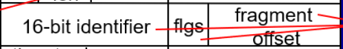
</p>

- ip datagram format에서 위 세가지 항목은 패킷을 분해하고 조립하는데 사용된다.

<p align="center">
    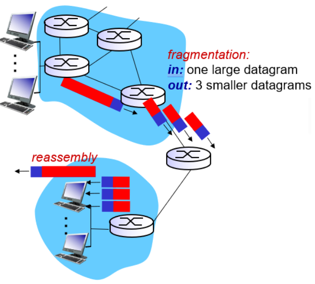
</p>

- IP 패킷은 생성되어 라우터를 거쳐 목적지로 간다.

- 라우터 사이의 링크에서 지원할 수 있는 최대 패킷 크기는 `MTU`라고 한다.

- 패킷 사이즈가 MTU보다 클 경우에 패킷이 지나갈 수 없다는 문제가 생긴다.

- 따라서 패킷을 MTU 사이즈에 맞게 분해해서 보낸다.

- 분해된 fragment 패킷은 도착지에서 다시 assemble이 된다. 이것을 위한 기록을 위의 필드에서 할 수 있다.

예를 통해서 보자. MTU는 1500bytes이다.

<p align="center">
    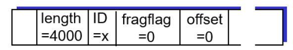
</p>

- 패킷이 4000bytes일 때 헤더는 20이고, 데이터가 3980이다.

- MTU는 1500bytes니까 패킷은 3개로 쪼개지게 되고, 이때 모든 패킷에 헤더가 20 바이트씩 붙게 된다.

<p align="center">
    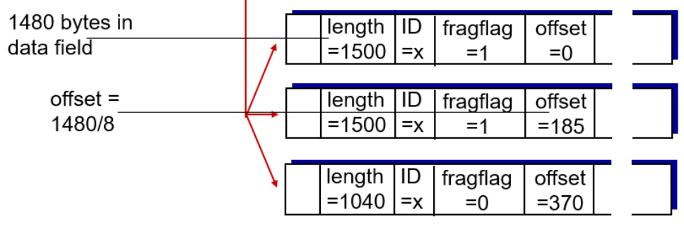
</p>

- ID는 공통으로 x가 되고, 뒤에 더 붙을 게 있으면 fragflg를 1로, 없으면 0으로 설정한다.

- offset은 데이터가 fragment의 어떤 위치에 있었는 지를 나타내준다.

- 이때 offset값을 /8을 해주는데 그 이유는 필드 크기를 줄이기 위함이다.

```

(1)번 패킷 = 첫번째 위치
즉, 0 / 8 = 0(offset)

(2)번 패킷 = 1480번째에 위치
즉, 1480 / 8 = 185(offset)

(3)번 패킷 = 2960번째에 위치
즉 2960 / 8 = 370(offset)
```

## 8. Dijkstra's algorithm for routing

라우팅 알고리즘의 결과를 통해 포워딩 테이블의 엔트리를 채울 수 있다. 그 중 하나로 `다익스트라 알고리즘`이 있다.

<p align="center">
    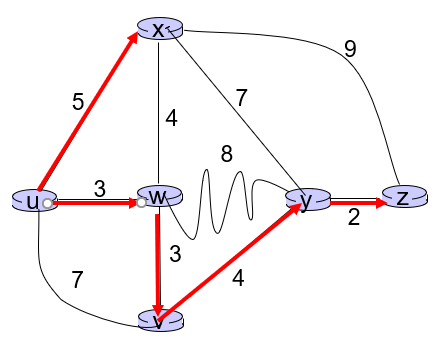
</p>

---

**(1) N에 나 자신인 u를 넣어서 초기화해준다.**

<p align="center">
    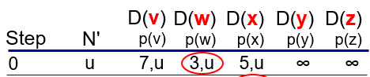
</p>

- 이웃한 노드들에 대해서는 포인트를 이웃하지 않은 노드들은 무한대를 설정한다.

- 이때 N'에 없으면서 D 값이 가장 작은 w가 N'에 속해지게 된다.

- `N'` : 내가 확실히 알게 된 노드들의 집합

---

**(2) W와 이웃한 모든 노드들에 대해서 D 값을 업데이트 한다.**

<p align="center">
    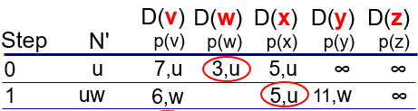
</p>

- W와 이웃한 노드는 X, Y, V이다.

- 업데이트 되는 공식은 `D(v) = min(D(v), D(w) + c(w,v))`이다.

- 즉 기존에 있던 값과 D(w) + c(w,v) 중 더 작은 값을 선택한다.

- c(w, v)란 첫 시작 부터 w까지의 코스트 + w에서 v까지 가기 위한 코스트

  - => 즉, w를 거쳐 v에 도달하기 위한 전체 코스트

- N`에 속한 노드는 D값을 업데이트 할 필요 없음

```
(1). V의 경우에는 기존에는 7이었는데, w를 거쳐서 가면 6이 되기 때문에 값이 6으로 변경된다.

(2). X는 기존의 5와 W를 거친 7 중 5가 더 작기 때문에 값이 7로 유지된다.

(3). Y는 무한대 값과 W를 거친 11 중 11이 더 작기 때문에 값이 6으로 변경된다.
```

최종결과 :

<p align="center">
    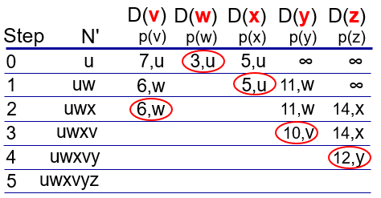
</p>

<p align="center">
    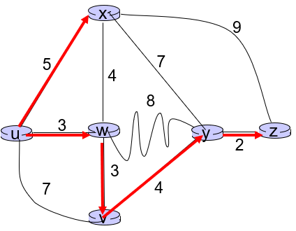
</p>

> 최소경로는 uwxvyz가 된다. 결과적으로 포워딩 테이블은 dest x일 때는 x에, 그 외에는 모두 w에 포워딩 해주면 된다.

> 다익스트라 알고리즘과 같은 link state 알고리즘의 특징은 least-cost path를 계산하기 전에 전체 그래프 모양을 알고 시작한다.(라우터가 전체 네트워크에게 자신의 링크 상태를 브로드 캐스팅을 하기 때문이다.)

- least-cost를 계산하는 다른 알고리즘으로는 거리-백터 알고리즘이 있다.

## 9. Distance vector algorithm

> 각자가 가진 distance vector들을 교환하는 알고리즘이다.

<p align="center">
    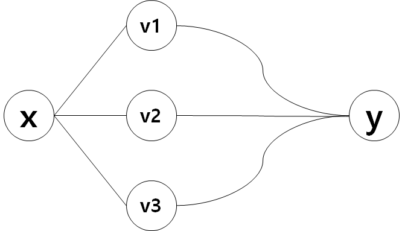
</p>

위와 같은 경우가 있다고 생각해보자.X→Y 까지의 least-cost path를 어떻게 구할 수 있을까?

- 우리는 최소 least-cost paht가 w, y, z 중 하나라는 것은 알고 있다.
- 이때 least-cost는

  - (1) c(x,v1) + dv1(y)

  - (2) c(x,v2) + dv2(y)

  - (3) c(x,v3) + dv3(y)

- 이렇게 세 개가 될 수 있고, 결국 여기서 제일 작은 값이 최단거리경로이다.

- 지금 c(x,v1)과 같은 값은 내 링크 값이기 때문에 값을 알고 있다.

- 그런데 dv1(y)는 내 입장에서 알지 못한다. 이를 알기 위해서는 내 이웃인 v1이 dv1(y) 값을 나에게 전달해주어야 한다.

- 이때 이 이웃한 것들의 거리들을 배열(dv1(y) 사이의 모든 경로)로 저장하기 때문에 벡터라고 한다.

- 다익스트라 처럼 link state는 브로드 캐스팅으로 전체 네트워크에 링크 상태를 전파한다. 하지만 거리-벡터 알고리즘은 그렇지 않고 이웃이랑만 정보를 공유한다.

**예시(Bellman-Ford exmple) :**

<p align="center">
    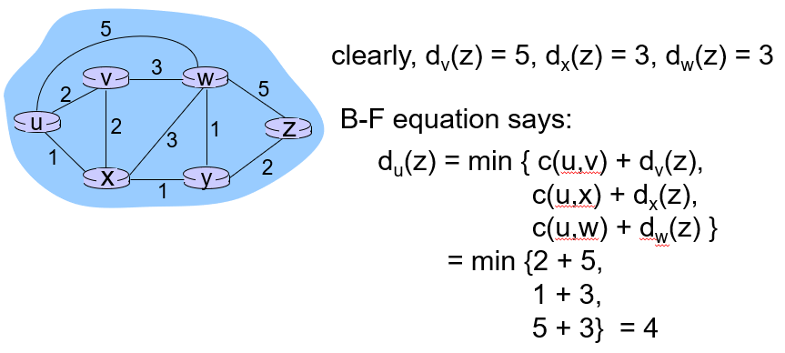
</p>

**동작 방식 :**

<p align="center">
    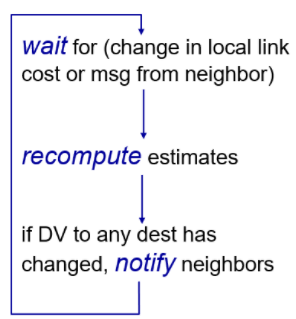
</p>

- local link 값이 변하거나 이웃 값이 변하면 다시 거리 값을 계산하고 이웃들에게 변경 사항을 알린다.

<p align="center">
    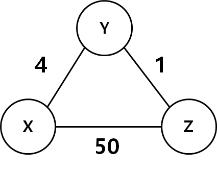
</p>

> 표는 왼쪽에서 위쪽까지의 최단 거리를 나타낸다. 위 그래프를 기준으로 이해해보자.

---

**(1) distance vector 교환을 하지 않았을 때**

- X를 기준으로
<p align="center">
    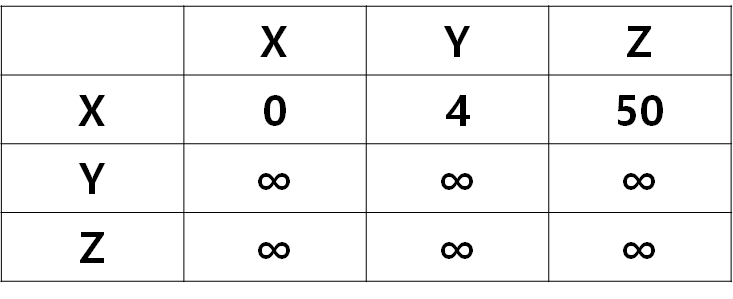
</p>

- X를 기준으로 생각하면 distance vector 교환을 하지 않았기 때문에 최소 거리를 몰라서 Y와 Z에 대한 값은 무한대로 잡힌다.

---

- Y를 기준으로
<p align="center">
    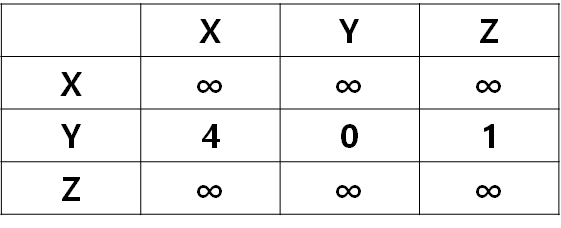
</p>

---

- Z를 기준으로

<p align="center">
    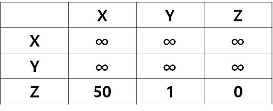
</p>

---

**(2) distance vector 교환 수행**

- 노드 3개 일 때 공식 `min(c(x,y) + dy(z), c(x,z) + dz(z))`
- X를 기준으로 distance vector 교환을 수행하면, 무한대로 잡혀 있던 값에는 이웃들이 보내준 값이 들어간다.
  X에서 Z로 가는 방법은 XYZ로 가거나 XZ로 가거나다.

- XYZ = `c(x,y) + dy(z)`

- XZ = `c(x,z) + dz(z)`

- 그럼 XYZ = 5고, XZ = 50이기 때문에 이 중 최소값인 XYZ(5)를 선택하게 된다.

<p align="center">
    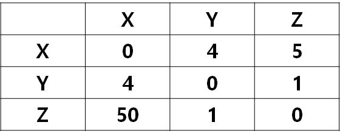
</p>

- 이런 식으로 계산을 하면 위의 표처럼 나온다.
- dy(z) 값은 distance vector 교환을 통해 알게 되었다.

즉, 아래처럼 구하게 된다.

> X→Z를 생각해보자. 그런 다음 자기 자신에 대한 벡터는 min 공식을 사용하여 다시 계산한다.

---

- Y를 기준으로

<p align="center">
    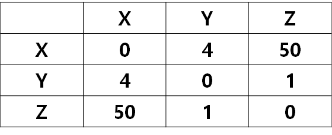
</p>

- Z를 기준으로
<p align="center">
    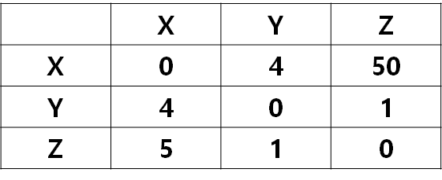
</p>

- 그럼 이때 X→Z와 Z→X 값이 바뀌었기 때문에 바뀐 값을 이웃에게 다시 보내주어야 한다.

---

**(3) distance vector 다시 구하기**

- X, Y, Z를 기준으로

<p align="center">
    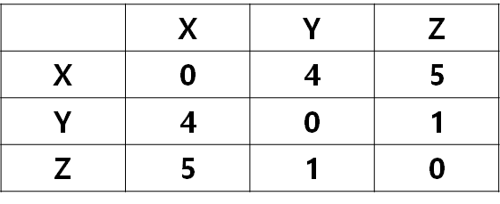
</p>

- X, Y, Z 표의 값이 이렇게 다 바뀌게 된다. distance vector 알고리즘은 stable한 상태가 될 때까지 값을 주고 받는다.

---

**stable한 상태였는데, link 값에 변화가 생긴 시나리오**

**(1) 더 좋아지는 경우**

<p align="center">
    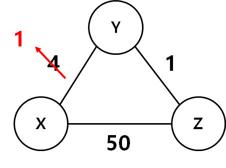
</p>

- 이때 X와 Y의 distance vector 값이 변한 것이기 때문에 X와 Y가 액션을 취한다.

- 현재 가지고 있는 표에서 X, Y는 X→Y, X→Z, Y→X, Y→Z에 대한 계산을 다시 수행한 후 변한 값을 다시 이웃들에게 보내준다.

- 그럼 이웃은 받은 값을 통해서 변경되는 값이 있는지 확인하고 있다면 다시 전송한다. 위에서 말한 (2)-(3)이 계속 반복되는 것이다.

- 더 좋아지는 경우에는 계산이 금방 끝난다. 이 경우에는 3번 정도만 교환하면 끝날 것이다.

**(2) 더 안 좋아지는 경우**

<p align="center">
    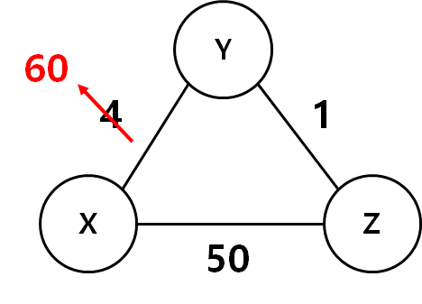
</p>

- 더 안 좋아지는 경우에는 stable하게 될 때까지 count 값이 많아진다.

- 이러한 문제를 `count to infinity` 라고 한다.

이 문제가 발생하는 이유는 `공식`때문이다.

예를 통해서 생각해보자.

(1) 60 반영

- X를 기준으로

<p align="center">
    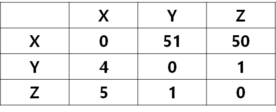
</p>

---

- Y를 기준으로

<p align="center">
    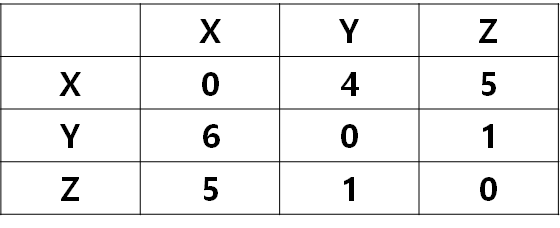
</p>

- Y→X를 보자.
- Y→Z로 가는 값이 5고, Z→X로 가는 값이 1이기 때문에 Y→X는 6으로 업데이트 된다.

---

- Z를 기준으로
<p align="center">
    
</p>

---

(2) 변한 값 반영

- X를 기준으로
<p align="center">
    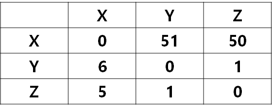
</p>

---

- Y를 기준으로
<p align="center">
    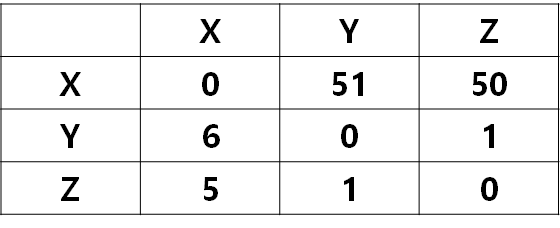
</p>

---

- Z를 기준으로
<p align="center">
    
</p>

- 그럼 전달 받은 값을 통해서 Z→X를 다시 계산하면, Z는 7이라는 값이 들어간다.

- 이런 식으로 가면 그 다음으로 계산하면 Y→X는 8, 그 다음은 Z→X는 9... 이런 식으로 50이 되기까지 엄청난 단계가 소요된다.

- 이 문제를 해결하기 위해서는 경로에 의존된 애한테는 값을 무한대로 넘겨주어야 한다.

- 즉, 위의 경우에는 Y→X를 구할 때 Y→Z→Y→X 이런 식으로 역류하기 때문에 값이 제대로 구해지지 않는 것이다. 그렇기 때문에 Z는 Z→X의 값이 Z→Y→X일 경우 Y에게는 최소값이 아닌 무한대 값을 주어야 한다.

- 이렇게 해도 문제가 생기지 않는 이유는 Z→Y→X로 가는 경우, Y→X의 값이 가장 최소 즉, best 이기 때문이다.

- 그래서 Z→X의 값을 무한대로 보내주어도 Y→X 값이 최소값이기 때문에 문제가 발생하지 않는다.

> 하지만 실제 네트워크에는 많은 링크들이 있다. 여기에 바로 link state 알고리즘이나 distance vector를 적용하긴 어렵다. 따라서 현대에는 이 문제를 해결하기 위해서 글로벌한 스케일의 네트워크 시스템에서 라우팅은 계층화를 시킨 이후에, 개별 네트워크에 라우터들끼린 위에서 언급한 알고리즘을 사용한다. 네트워크 사이의 연결을 상위에 있는 라우터들이 처리한다.

## 10. Interconnected ASes

- `AS` : autonomous systems

  - 예를들어, 한양대 네트워크 내부에서 어떤 라우팅 알고리즘을 사용할지 내부에서 정한다.

- AS를 구별하기 위해 AS 번호를 부여함

  - 16bit로 구성
  - 현재 전세계 AS 갯수는 65535개

- AS끼리 서로 연결되어 있다.

- AS는 네트워크 기관 혹은 ISP라고도 한다.

---

## 11. Relationships between networks

**provider, customer 관계**

- AS와 AS 사이에서도 인터넷을 제공한다. (provider(isp) <-> customer(한양대))

- 갑을관계가 명확하다.

- 서비스에 대한 사용료를 지불해야한다.

---

**peering 관계**

- AS간에 서로 필요한 관계도 존재한다.
  - peering 관계라고 함
  - eX) SKT, KT (체급이 비슷)
  - 둘 사이 회선을 두고 무료로 연결한다.

> AS 간에 오고가는 트래픽에 대해서는 여러가지 정책이 포함되는데 이러한 복잡한 것을 구현하기 위해서 BGP라는 포로토콜이 있다.
