# 링크 계층

```
한양대학교 이석복 교수님의 컴퓨터네트워크 강의를 요약한 글임을 미리 밝힙니다. 문제가 될 경우 삭제 조치 하겠습니다.
```

## TOC

1. [Introduction](#1-introduction)
2. [MAC](#2-mac)
3. [MAC 프로토콜 종류](#3-mac-프로토콜-종류)
4. [ethernet](#4-ethernet)
5. [MAC 주소](#5-mac-주소)
6. [Switch](#6-switch)
7. [내부 네트워크 구성](#7-내부-네트워크-구성)

---

## 1. Introduction

<p align ="center">
    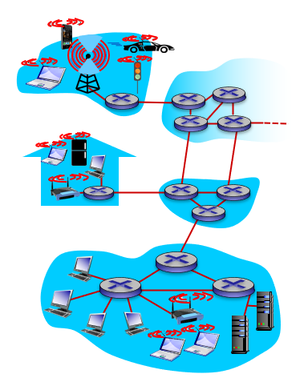
</p>

- 호스트와 라우터 사이에는 전용선이 존재하는 것이 아니라, 공용선을 통해서 패킷이 전송된다.

- 링크 레이어에서는 충돌을 피하면서 패킷을 잘 보내는 것에 중점을 둔다.

- 구글로 향하는 패킷이 GW 라우터에 전달되어야 한다.

- 이 패킷의 목적지는 구글이지만, 가는 도중에 여기저기 다 들리게 될 것이다.

- 우리가 거리에서 멀리 있는 누군가를 부를 때 그 길에 있는 모든 사람들에게 들리는 것처럼. 그래서 동시에 두 개가 전송되면, 충돌이 발생하게 되고 우리는 이 충돌을 피해야 한다.

> TCP와 IP는 운영체제에 구현되어 있고, 링크 레이어는 OS 안의 네트워크 인터페이스 카드에 구현되어 있다.

` 애플리케이션 메시지 → 세그먼트 → 패킷 → 프레임`

## 2. MAC

- 목적지까지 많은 multiple node들이 접근한다.

- 이걸 또 다른 의미로 media access control이라고 해서 MAC이라고도 한다.

  - 여러 노드들이 동일 회선에서 프레임을 충돌없이 잘 제어할 수 있도록 함

- 링크 레이어에서 맥은 여러 호스트가 액세스 하는 걸 잘 컨트롤 하기 위해 존재한다.

**이상적인 MAC 프로토콜**

> link bandwidth가 R이라고 했을 때,

(1) 한 사람만 할 얘기가 있을 경우, 한 사람이 R을 다 쓸 수 있어야 한다.

(2) 여러 명이 동시에 사용하고 싶을 경우, 각각 1/R씩 사용할 수 있어야 한다.

(3) 분산적이어야 한다.

(4) 간단해야 한다.

## 3. MAC 프로토콜 종류

**1. Channel partitioning MAC**

(1) `TDMA` :여러 명이 액세스를 할 때 시간을 나눠서 액세스 하는 것

<p align ="center">
    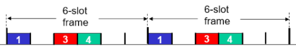
</p>

- 그림처럼 하나의 시간 단위를 6칸으로 나누고 6명에게 배정하는 방식이다.

- 이렇게 하면 충돌은 발생하지 않지만, 한 명만 할 말이 있을 경우 나머지 슬롯이 낭비되는 문제가 있다.

(2) `FDMA` : 다른 대역폭을 사용할 수 있게 하는 것

<p align ="center">
    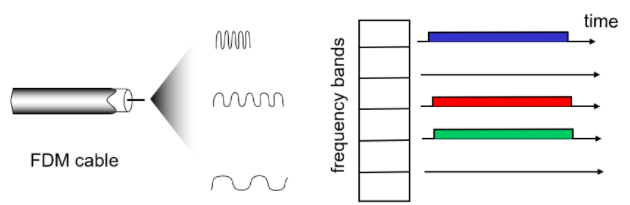
</p>

TDMA와 마찬가지로 낭비가 발생한다.

---

**2. Random access protocols**

> 얘기 있을 경우에만 말하라고 하는 것. TDMA와 FDMA랑 비교했을 때 훨씬 유연하다.

(1) `CSMA(carrier sense multiple access)`

- A가 할 말이 있고 전송할 프레임이 있을 때, 전송 전에 한 번 질의를 하는 것.

- 이때 누가 얘기하고 있으면 전송을 하지 않고 아무도 얘기하지 않으면 전송하는 것을 말한다!

- 이렇게 해도 충돌이 발생한다.

충돌이 발생하는 예시

<p align ="center">
    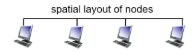
</p>

<p align ="center">
    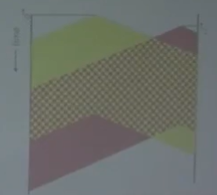
</p>

(1) 2번째 애 → 아무도 전송을 하고 있지 않아서 전송 시작

(2) 4번째 애 → 2번째 애가 전송하고 있지만 자기랑 겹치지 않으니까 괜찮다고 생각하고 전송 시작

(3) 2번째와 4번째의 충돌 발생!

이게 일어나는 이유는 `전자기파의 속도가 제한적`이기 때문이다.

> 프레임 시작과 동시에 모두에게 퍼지면 충돌이 발생하지 않을 텐데, 그게 가능하지 않기 때문에 collision을 완전히 없앨 수가 없다. 우리는 이게 발생했을 때 생기는 데미지를 최소화 해야 한다. 그래서 등장한 것이 CSMA/CD이다.

(2) `CSMA/CD` : 충돌이 발생하면 얘기를 바로 그만두는 것

<p align ="center">
    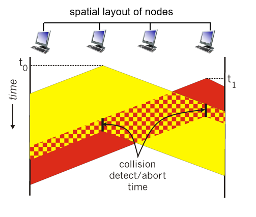
</p>

- CSMA/CD는 collision이 발생하면 프레임 전송을 그만둔다.

- 프레임 전송을 그만한 프레임은 재전송을 해주어야 한다.

- 이때 쟁점은 언제 재전송을 할지다.

> 재전송은 랜덤 타임을 돌리는데, range를 어떻게 설정해야 할까?

- (1) `range를 길게`
  - 계속 기다려야 한다.
- (2) `range를 짧게`
  - 빨리 요청할 수 있다.
  - 충돌이 발생활 확률이 더 높다.

=> 둘 다 문제가 많다.

> 그래서 생각해낸 것이 첫 충돌은 랜덤 폭을 짧게 하고, 충돌이 발생하면 2배로 늘려가는 방식이다.

즉, 정리하자면

1. 내가 보낼 프레임이 있을 때 얘기 중인지 보고

2. 얘기 중이면 기다리고 아니면 보내고

3. 다 보내기 전에 충돌 감지되면 충돌 멈추고

4. 랜덤 시간을 두고 재전송

⇒ 항시 경쟁 체제가 된다.

Channel과 Random은 서로의 장점이 서로의 단점이고, 서로의 단점이 서로의 장점이다.

Channel : 사용자가 많으면 효율적
Random : 사용자가 적으면 효율적

> 이 둘의 장점만 쓴 게 Taking turns이다.

---

**3. Taking turns**

(1) `polling`: 마스터로 관리하지만, 마스터가 고장나면 문제가 생긴다.

<p align ="center">
    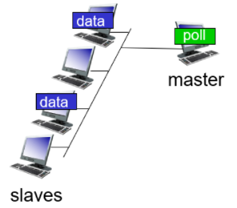
</p>

(2) `token passing` : 토큰을 가지고 있는 애들만 전송하는 방식 (토큰을 돌려가면서 사용한다)

- 토큰을 잃어버리면 문제가 생긴다.

<p align ="center">
    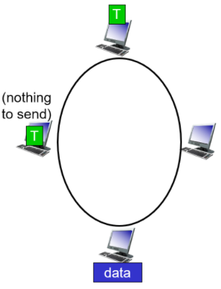
</p>

> (1)과 (2)는 하나가 망하면 전체가 망하는 방식이어서 사용하지 않는다.

## 4. Ethernet

**이더넷 프레임 구조**

<p align ="center">
    
</p>

- PREAMBLE : 이더넷이라는 걸 알려주는 것
- ADDRESS : MAC 어드레스가 들어감
- CRC : 에러 체크를 위한 필드
- DATA : 패킷이 들어가는 부분(네트워크 계층)

---

**동작 방식**

> CSMA/CD를 통해서 이더넷이 동작한다.

- 링크 레이어는 피드백이 존재하지 않는다. 즉, 확실히 갔는지 확신을 가질 수 없다.

- 피드백이 없는 이유는 충돌이 없으면 무사히 가기 때문이다.

- 그럼 링크 레이어에서는 충돌의 유무가 매우 중요하다. 즉, collision detection이 매우 중요하다.

- 결론은 CSMA/CD에서 충돌을 100% 탐지해야 한다.

> Q. collision이 일어났는데 탐지를 못하는 상황이 있을까?

=> 그렇다.

(1) A는 아무도 전송을 하고 있지 않아서 G에게 프레임 전송

(2) A의 프레임이 G에 도착하기 전에 G는 프레임을 전송하려고 하고, 아무도 전송하고 있지 않아서 G는 A에게 프레임 전송

(3) A의 프레임이 G에 들어오면서 G에서는 충돌이 발생 → A의 프레임이 유실됨

(4) G는 이미 보냈기 때문에 보낸 프레임은 계속 A에게 가게 됨

(5) G가 보낸 프레임이 A에 도착하기 전에 A의 프레임 전송이 끝남

(6) G가 보낸 프레임이 A에 도착함(충돌 발생 X)

이 경우에 A는 충돌을 탐지하지 못한다. 이때 프레임 재전송이 되지 않아 유실되는 문제가 발생한다.그래서 이런 문제를 해결하기 위해서 노선의 길이에 따른 `minimum 프레임 사이즈`를 정한다.

만약 minimum 프레임 사이즈보다 작은 프레임을 보낼 경우에는 `패딩`을 붙여서 이를 보냄으로써 올 때까지 기다릴 충분한 시간을 확보해준다.

## 5. MAC 주소

> 개체를 지칭하기 위해 사용하는 것으로, 변하지 않는 값

- 이름 ← hostname(www.naver.com)
- 주소 ← IP 주소
- 주민등록번호 ← MAC 주소

- MAC은 네트워크 인터페이스 카드가 제조되는 순간 제조사에서 찍혀서 영원히 같은 값을 가진다.

- 머신의 IP 주소는 계속 바뀌지만 MAC 주소는 바뀌지 않는다.

- MAC 주소는 48비트로 되어 있고, 16진수로 끊어서 표현한다.

- 이때 앞의 24비트는 제조사, 뒤 24비트는 제조사의 일련번호이다.

---

**ARP**

> IP 주소를 바탕으로 MAC이 무엇인지 알 수 있도록 해주는 것.

- 로컬의 경우, src에는 A의 맥 어드레스가 dst에는 FF:FF:FF~~가 들어간다.

예시를 통해 알아보자.

A는 구글에 프레임을 보내려고 한다. 이때 전송을 하기 위한 과정은 어떻게 될까?

- IP PKT은 DATA + A주소 + 받는 쪽 주소(DNS 쿼리를 통해 알아냄)

- 최종적으로 FRAME의 src에는 A의 맥주소가, dst에는 google의 맥주소가 필요하다.

- google에 접근하기 전에 거치는 gateway의 맥주소가 먼저 dst가 된다.

- DHCP로는 알 수 없다.

- ARP를 통해 gateway의 IP 주소(DHCP를 통해 알아냄)에 대응되는 MAC 주소를 알아낸다.
  → ARP table에 기록된다.

- 이런 식으로 다음 목적지에 대해서, 1) 포워딩 테이블을 통해 IP 주소 알아내기, 2) ARP 테이블에서 MAC 주소 알아내기를 반복하며 목적지인 google에 도착하게 된다.

- 이때 TTL 값을 제외하고 최초의 IP PKT 값은 변하지 않는다.

## 6. Switch

<p align ="center">
    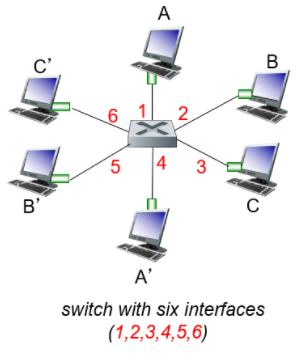
</p>

A → A'이 발생했을 때 스위치는 A'이 4번이라는 걸 어떻게 알고 보내줄까? → 스위치 테이블을 통해서 알아낸다.

<p align ="center">
    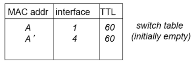
</p>

A → A'이 발생했을 경우,

(1) 스위치는 1번에서 A가 들어왔기 때문에 A가 1번 인터페이스에 달려있는 것을 알 수 있다.

(2) `self-learning`을 위해 1번을 제외한 모든 인터페이스에 flood를 수행한다.

(3) 플러딩을 통해 4번 인터페이스가 A'임을 알아낼 수 있다.

<p align ="center">
    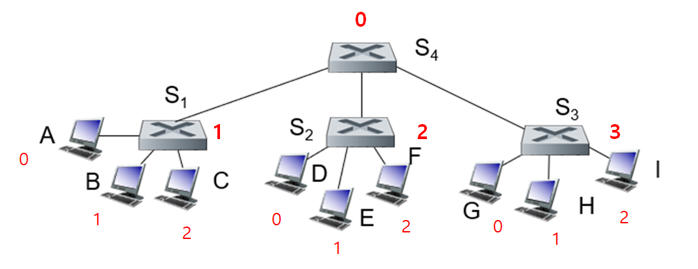
</p>

이런 식으로 스위치에 스위치가 꽂힌 형태는 어떻게 self-learning이 진행될까?

C → I의 경우를 생각하자!

(1) S4 기준으로 C가 1번에 있다는 것을 알 수 있다.

(2) S2와 S3는 0번으로부터 받았기 때문에 C가 0번에 있다고 인식하게 된다.

(3) S3는 I가 2번에(내부), S4는 I가 3번에 있다는 것을 알게 된다.

(4) S1도 I가 0번에 있음을 알게 되고 정상적으로 C→I가 수행된다.

이러한 과정을 스위칭이라고 한다.

next-hop을 찾는다는 관점에서 포워딩과 스위칭은 비슷하다.

차이점은 포워딩은 라우팅 알고리즘을 돌렸지만, 스위칭을 flooding으로 한다는 것.

## 7. 내부 네트워크 구성

<p align ="center">
    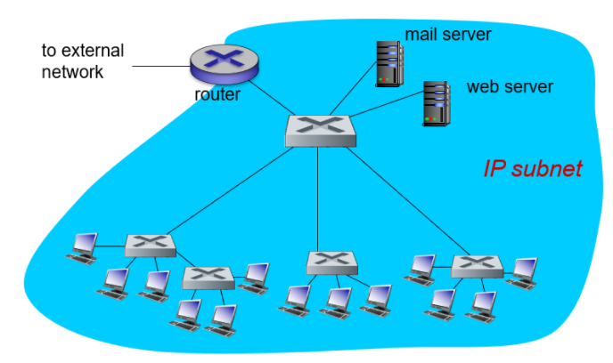
</p>

+) DHCP, NAT 서버도 존재한다.
