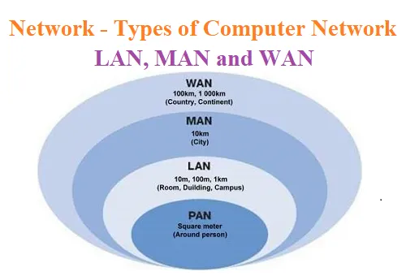

# 네트워크 기초

```
길벗 출판사, 면접을 위한 CS 전공 지식 노트를 요약한 글임을 미리 밝힙니다. 문제가 될 경우 삭제 조치 하겠습니다.
```

## TOC

1. [처리량과 지연시간](#11-처리량과-지연시간)
2. [네트워크 토폴로지와 병목 현상](#12-네트워크-토폴로지와-병목-현상)
3. [네트워크 분류](#13-네트워크-분류)
4. [네트워크 성능 분석 명령어](#14-네트워크-성능-분석-명령어)
5. [네트워크 프토토콜 표준화](#15-네트워크-프로토콜-표준화)

---

> 네트워크는 node와 link가 서로 연결되어 있거나 연결되어 있지 않은 집합체를 의미한다.

- 노드: 서버, 라우터, 스위치 등과 같은 네트워크 장치
- 링크: 유선 또는 무선을 의미

## 1.1 처리량과 지연시간

> 좋은 네트워크는 많은 처리량 + 지연 시간 짧음 + 장애 빈도 적음 + 좋은 보안을 갖춤

**처리량(throughput) :** 처리량이란 링크를 통해 전달되는 단위 시간당 데이터량

- bps(bits per second) 단위를 사용
- 초당 전송 또는 수신되는 비트 수
- 트래픽, 네트워크 장치 간의 대역폭, 네트워크 중간에 발생하는 에러, 장치의 하드웨어 스펙에 영향을 받음

**대역폭** : 주어진 시간 동안 네트워크 연결을 통해 흐를 수 있는 최대 비트 수

---

**지연시간(latency) :** 요청이 처리되는 시간

- 어떤 메시지가 두 장치 사이를 왕복하는 데 걸린 시간
- 매체타입(무선, 유선), 패킷 크기, 라우터의 패킷 처리 시간에 영향을 받음

## 1.2 네트워크 토폴로지와 병목 현상

> 네트워크 토폴로지는 노드와 링크가 어떻게 배치되어 있는지에 대한 방식이자 연결 형태이다.

<p align ="center">

</p>

**트리 토폴로지 :** 계층형 토폴로지라고 하며 트리 형태로 배치한 네트워크 구성이다.

- 노드의 추가, 삭제가 쉬우며, 특정 노드에 트래픽이 집중될 때 하위 노드에 영향을 끼칠 수 있다.

---

**버스 토폴로지 :** 중앙 통신 회선 하나에 여러 개의 노드가 연결되어 공유하는 네트워크 구성

- 근거리 통신망(LAN)에서 사용한다.
- 설치 비용이 적고 신뢰성이 우수하다.
- 중앙 통신 회선에 노드를 추가하거나 삭제하기 쉽다.
- 스푸핑의 문제가 가능함

**스푸핑이란?**

> LAN 상에 송신 패킷을 관련 없는 다른 호스트에 가지 않도록 하는 스위칭 기능을 마비시키거나, 속여서 특정 노드에 해당 패킷이 오도록 처리하는 것, 스푸핑이 적용되면 올바른 수신 장치에 가야 할 패킷이 악의적인 노드에 전달된다.

---

**스타 토폴로지 :** 중앙 노드에 모두 연결된 네트워크 구성

- 노드를 추가하거나 에러를 탐지하기 쉽다.
- `패킷 충돌 발생 가능성`이 적다.
- 한 노드에 장애가 발생해도 쉽게 에러를 발견할 수 있다.
- 장애 노드가 중앙 노드가 아닐 경우, 다른 노드에 영향을 끼치는 것이 적다.
- 중앙 노드에 장애가 발생하면 전체 네트워크를 사용할 수 없다.
- 설치 비용이 고가이다.

---

**링형 토폴로지** : 각 노드가 양 옆의 두 노드와 연결하여 전체적으로 고리처럼 하나의 연속된 길을 통해 통신을 하는 망 구성 방식

- 데이터는 노드에서 노드로 이동
- 각 노드는 고리 모양 길을 통해 패킷 처리
- 노드 수가 증가되어도 네트워크상의 손실이 거의 없고 충돌이 발생되는 가능성이 적다.
- 노드의 고장 발견을 쉽게 찾을 수 있다.
- 네트워크 구성 변경이 어렵다.
- 회선에 장애가 발생하면 전체 네트워크에 영향을 크게 끼친다.

---

**메시 토폴로지 :** 망형 토폴로지라고도 하며 그물망처럼 연결되어 있는 구조

- 한 단말 장치에 장애가 발생해도 여러 개의 경로가 존재해서, 네트워크를 계속 사용 가능
- 트래픽 분산 처리 가능
- 노드 추가 어렵다.
- 구축 비용과 운용 비용이 고가이다.

---

=> 토폴로지가 중요한 이유는 병목 현상을 찾을 때 중요한 기준이 되기 때문!

```
병목현상(bottleneck)이란 전체 시스템의 성능이나 용량이 하나의 구성 요소로 인해 제한을 받는 현상이다.
```

## 1.3 네트워크 분류

규모를 기반으로 네트워크 분류 가능

<p align ="center">

</p>

**LAN(Local Area Network)** : 근거리 통신망(같은 건물, 캠퍼스 같은 작은 공간)

- 전송 속도 빠름
- 혼잡하지 않음

---

**MAN(Metropolitan Area Network)** : 대도시 지역 네트워크 (도시 같은 넓은 지역에서 운영)

- 전송 속도는 평균
- LAN 보다 혼잡

---

**WAN(Wide Area Network)** : 광역 네트워크 (국가, 대륙 같은 넓은 지역에서 운영)

- 전송 속도 낮음
- MAN 보다 혼잡

```
네트워크 혼잡은 인터넷을 통해 한 번에 너무 많은 전송이 전송됨을 의미
```

## 1.4 네트워크 성능 분석 명령어

네트워크 병목 현상의 주된 원인은 다음과 같다.

- 네트워크 대역폭
- 네트워크 토폴로지
- 서버 CPU, 메모리 사용량
- 비효율적인 네트워크 구성

네트워크 관련 테스트와 네트워크와 무관한 테스트를 통해 `네트워크로부터 발생한 문제점`을 확인하고,
네트워크 성능 분석을 해야한다.

**ping(Packet INternet Groper):** 네트워크 상태를 확인하려는 대상 노드를 향해 일정 크기의 패킷을 전송하는 명령어

- 해당 노드의 패킷 수신 상태와 도달하기까지 시간 등을 알 수 있다.
- 해당 노드까지 네트워크가 잘 연결되어 있는지 확인 가능
- TCP/IP 프로토콜 중 ICMP 프로토콜 사용
  - ICMP 프로토콜을 지원하지 않는 기기를 대상으로 실행 불가
  - 네트워크 정책상 ICMP나 traceroute를 차단하는 대상의 경우 ping 테스팅 불가

패킷 12개 던지기

```cmd
ping www.google.com -n  12
```

---

**netstat:** 접속되어 있는 서비스들의 네트워크 상태를 표시하는 데 사용

- 네트워크 접속, 라우팅 테이블, 네트워크 프로토콜 리스트를 출력
- 서비스의 포트가 열려 있는지 확인할 때 사용
- 네트워크 상태 리스트 확인 명령어

```cmd
netstat
```

---

**tracert:** 목적지 노드까지 네트워크 경로를 확인하는 명령어

- 목적지 노드까지 구간들 중 어느 구간에서 응답 시간이 느려지는지 확인 가능
- windows에서는 tracert
- 리눅스에서는 traceroute

---

위 설명된 것 이외에도, `ftp`를 통해 대형 파일을 전송하여 테스팅하거나 `tcpdump`를 통해 노드로 오고 가는 패킷을 캡처하는 등의 명령어가 존재하며, 네트워크 분석 프로그램으로는 `wireshark`, `netmon`이 존재한다.

## 1.5 네트워크 프로토콜 표준화

**네트워크 프로토콜:** 다른장치들끼리 데이터를 주고받기 위해 설정된 공통된 인터페이스

- 프로토콜은 기업이나 개인이 발표해서 정하는 것이 아닌 `IEEE` 혹은 `IETF` 라는 표준화 단체가 정한다.

- `IEEE802.3`은 유선 LAN 프로토콜로, 유선으로 LAN을 구축하는 데 사용되는 프로토콜이다.
- 이런 프로토콜로 다른 장치라도 서로 데이터를 송수신 가능하다.
- 웹을 접속할 때는 HTTP를 사용가능하다.

```
프로토콜은 서로 약속된 인터페이스이다.
```
