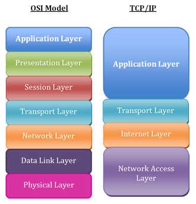
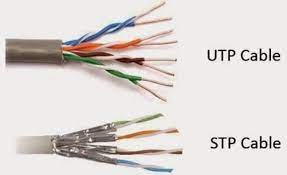
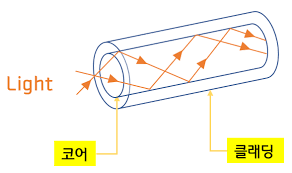
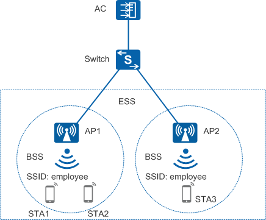
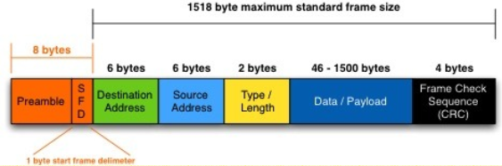
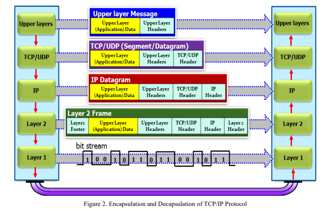

# TCP/IP 4계층 모델

```
길벗 출판사, 면접을 위한 CS 전공 지식 노트를 요약한 글임을 미리 밝힙니다. 문제가 될 경우 삭제 조치 하겠습니다.
```

## TOC

1. [계층 구조](#21-계층-구조)
2. [애플리케이션 계층](#22-애플리케이션-계층)
3. [전송 계층](#23-전송-계층)
4. [인터넷 계층](#24-인터넷-계층)
5. [링크 계층(네트워크 접근 계층)](#25-링크-계층네트워크-접근-계층)
6. [계층 간 데이터 송수신 과정](#26-계층-간-데이터-송수신-과정)
7. [PDU(Protocol Data Unit)](#27-pduprotocol-data-unit)

---

`인터넷 프로토콜 스위트(internet protocol suite)`는 인터넷에서 컴퓨터들이 서로 정보를 주고 받는 데 사용하는 프로토콜의 집합이다.

- OSI 7계층 혹은 TCP/IP 4계층으로 설명한다.
- TCP/IP 4계층이란 네트워크에서 사용되는 통신 프로토콜의 집합이다.
- 계층들은 프로토콜의 네트워킹 범위에 따라 네 개의 추상화 계층으로 구성됨

## 2.1 계층 구조

TCP/IP는 4개의 계층을 가지고, OSI 7계층과 비교된다.

<p align ="center">

</p>

- 계층들은 특정 계층이 변경되었을 때 다른 계층이 영향을 받지 않도록 설계되었다.
- 전송 계층에서 TCP를 UDP로 변경했다고 해서 웹 브라우저를 다시 설치할 필요가 없다.

## 2.2 애플리케이션 계층

- FTP, HTTP, SSH, SMTP, DNS 등과 같은 응용 프로그램이 사용되는 프로토콜 계층
- 웹 서비스, 이메일 등 서비스를 실질적으로 사람들에게 제공하는 계층이다.

```
FTP: 장치와 장치 간 파일 전송하는 데 사용되는 표준 통신 프로토콜

SSH: 보안되지 않은 네트워크에서 네트워크 서비스를 안전하게 운영하기 위한 암호화 네트워크 프로토콜

HTTP: World Wide Web을 위한 데이터 통신의 기초이자 웹 사이트를 이용하는 데 사용되는 프로토콜

SMTP: 전자 메일 전송을 위한 인터넷 표준 통신 프로토콜

DNS: 호스트의 도메인 이름을 호스트의 네트워크 주소로 바꾸거나 그 반대의 변환을 수행하는 프로토콜
```

---

## 2.3 전송 계층

- 송신자와 수신자를 연결하는 통신 서비스를 제공한다.
- 연결 지향 데이터 스트림 지원
- 신뢰성, 흐름 제어 제공
- 애플리케이션과 인터넷 계층 사이의 데이터가 전달될 경우 중계 역할
- TCP/UDP가 있음

`TCP`는 패킷 사이의 순서를 보장하며, 신뢰성을 구축해 수신 여부를 확인하며 가상회선 패킷 교환 방식을 사용한다.

반면 `UDP`는 순서를 보장하지 않고, 수신 여부를 확인하지 않으며, 단순히 데이터만 주는 데이터그램 패킷 교환 방식을 사용한다.

---

**가상회선 패킷 교환 방식:**

<p align ="center">

</p>

- 각 패킷에 가상회선 식별자가 포함
- 모든 패킷을 전송하면 가상회선이 해제
- 패킷들은 전송된 순서대로 도착하는 방식

---

**데이터그램 패킷 교환 방식:**

<p align ="center">

</p>

- 패킷이 독립적으로 이동하여 최적의 경로를 선택해서 간다.
- 하나의 메시지에서 분할된 여러 패킷은 서로 다른 경로로 전송될 수 있다.
- 즉, 순서가 다를 수 있는 방식이다.

---

**TCP 연결 성립 과정:**

<p align ="center">

</p>

- TCP는 신뢰성을 확보할 떄 `3-way handshake` 라는 작업을 진행한다.
- 클라이언트는 `CLOSED`, 서버는 `LISTEN` 상태일 경우 연결 성립
- UDP는 이 과정이 없기 때문에 신뢰성이 없는 계층이다.

  - `SYN 단계` : 클라이언트는 서버에 클라이언트의 ISN을 담아서 SYN을 보낸다.

    - 이 시점에 클라이언트 상태는 `CLOSED` -> `SYN-SENT` 변경

  - `SYN + ACK 단계` : 서버는 클라이언트의 SYN을 수신하고, 서버의 ISN을 보내며 승인번호로 클라이언트 ISN + 1을 보낸다.

    - 이 시점이 끝나면 서버 상태는 `LISTEN` -> `SYN-RECEIVED` 변경
    - 이 시점이 끝나면 클라이언트 상태 `SYN-SENT` -> `ESTABLISHED` 변경

  - `ACK 단계` : 클라이언트는 서버의 ISN + 1한 값인 승인번호를 담아 ACK를 서버에 보낸다.

    - 이 시점이 끝나면 서버 상태 `SYN-RECEIVED` -> `ESTABLISHED` 변경
    - 연결 성립

> Sequence Number는 데이터의 고유한 번호이며 32bit로 구성된다. SYN flag를 설정했을 경우 사용되는 번호이다. TCP는 데이터를 보낼 때마다 데이터에 고유한 번호를 부여한다. 이 번호를 사용해서 수신자가 중복된 데이터를 폐기하거나 아니면 순서가 뒤바뀌어 수신됐을 때 데이터를 순서대로 재구성할 수 있다.

> ISN(Initial Sequence Number)이란 TCP는 새로운 연결을 할 경우, 새로운 Sequence Number를 사용하는데, 최초로 랜덤하게 보내지는 게 ISN이다.

**유니크한 ISN :**

```
ISN은 0부터 4,294,967,295까지의 아무 값이나 될 수 있다.일반적으로 4ms마다 Sequence Number의 값이 변화되기 때문에 ISN값은 4.55시간에 한 번씩 동일해진다. 하지만 네트워크에서 패킷이 살아있는 시간(Maximum Segment Lifetime)은 항상 4.55시간 보다 작다. 그래서 ISN값은 항상 유니크하게 생성됨을 보장한다.
```

> MSL (Maximum Segment Lifetime)은 네트워크에서 패킷이 살아있는 시간이다. 이 시간이 지나면 라우터에서 패킷을 폐기한다. 이 시간은 보통 2분 정도 된다.

---

**TCP 연결 해제 과정:**

<p align ="center">

</p>

- TCP가 연결을 해제할 때는 `4-way handshake` 과정이 발생한다.

- 클라이언트가 연결을 닫으려고 할 때 `FIN`으로 설정된 세그먼트를 보낸다. 이후 클라이언트는 `FIN_WAIT_1` 상태로 들어가고 서버의 응답을 기다린다.

- 서버는 클라이언트로 `ACK`라는 승인 세그먼트를 보낸다. 이후 `CLOSE_WAIT` 상태에 들어간다. 클라이언트가 세그먼트를 받으면 `FIN_WAIT_2` 상태에 들어간다.

- 서버는 `ACK`를 보내고 일정 시간 이후에 클라이언트에 `FIN` 세그먼트를 보낸다.

- 클라이언트는 `TIME_WAIT` 상태가 되고 다시 서버로 `ACK`를 보내며, 서버는 `CLOSED` 상태가 된다. 이후 클라이언트는 어느 정도의 시간을 대기하고 연결이 닫히며 클라이언트와 서버의 모든 자원의 연결이 해제된다.

> TIME_WAIT이 왜 발생하는가? 그냥 연결을 닫으면 되잖아..!

- 첫 번째 이유는 지연 패킷이 발생할 경우를 대비하기 위함이다.

  - 패킷이 뒤늦게 도달하고 처리핮 못하면 데이터 무결성 문제가 발생한다.

- 두 번째 이유는 두 장치가 연결이 닫혔는지 확인하기 위함이다.
  - 만약 `LAST_ACK` 상태에서 닫힌다면, 다시 새로운 연결을 하려고 할 때 장치는 줄곧 `LAST_ACK`로 되어 있기 때문에 접속 오류가 나타나게 될 것이다.

이러한 이유들로 `TIME_WAIT`이라는 지연 시간이 필요하다.

```
TIME_WAIT : 소켓이 바로 소멸되지 않고 일정 시간 유지되는 상태를 말한다. 지연 패킷 등의 문제점을 해결하는데 사용된다. CentOS6, 우분투에는 60초로 설정되어 있다. 즉, OS마다 조금씩 다를 수 있다.

데이터 무결성(data integrity) : 데이터의 정확성과 일관성을 유지하고 보증하는 것
```

## 2.4 인터넷 계층

- 장치로부터 받은 네트워크 패킷을 IP 주소로 지정된 목적지로 전송하기 위해 사용되는 계층이다.

- IP, ARP, ICMP 등이 있다.

- 패킷이 수신해야 할 상대의 주소를 지정해서 데이터를 전달한다.
- 상대방이 받았는지 관심 없다. 즉, 비연결형적인 특징을 가진다.

## 2.5 링크 계층(네트워크 접근 계층)

- 전선, 광섬유, 무선 등으로 실질적으로 데이터를 전달한다.
- 장치 간에 신호를 주고받는 `규칙`을 정하는 계층이다.

> OSI 7 계층에서는 물리 계층과 데이터 링크 계층으로 나누기도 하는데, 물리 계층은 무선 LAN과 유선 LAN을 통해 0과 1로 이루어진 데이터를 보내는 계층을 말하며, 데이터 링크 계층은 `이더넷 프레임`을 통해서 에러 확인, 접근 제어를 담당하는 계층을 말한다.

> 이더넷(영어: Ethernet)은 컴퓨터 네트워크 기술의 하나로, 일반적으로 LAN, MAN 및 WAN에서 가장 많이 활용되는 기술 규격이다.[1] '이더넷'이라는 명칭(이름)은 빛의 매질로 여겨졌던 에테르(ether)에서 유래되었다. 이더넷은 OSI 모델의 물리 계층에서 신호와 배선, 데이터 링크 계층에서 MAC(media access control) 패킷과 프로토콜의 형식을 정의한다. 이더넷 기술은 대부분 IEEE 802.3 규약으로 표준화되었다. 현재 가장 널리 사용되고 있으며, 토큰 링, FDDI 등의 다른 표준을 대부분 대체했다.

---

**유선 LAN(IEEE802.3):**

- 유선 LAN을 이루는 이더넷은 IEEE802.3이라는 프로토콜을 따른다.
- 전이중화 통신을 사용

---

**전이중화 통신(full duplex):**

- 양쪽 장치가 동시에 송수신할 수 있는 방식
- 송신로와 수신로로 나눠서 데이터를 주고받는다.
- 현대의 고속 이더넷은 이 방식을 기반으로 통신한다.

---

**CSMA/CD:**

- 이전에 유선LAN에 `반이중화 통신` 중 하나인 CSMA/CD(Carrier Sense Multiple Access witch Collision detection) 방식을 사용했다.

- 데이터를 보낸 이후 충돌이 발생하면 일정 시간 이후 재전송하는 방식이다.

- 수신로와 송신로를 각각 둔 것이 아닌, 한 경로를 기반으로 데이터를 보내기 때문에 데이터를 보낼 때 충돌에 대해 대비해야 했기 때문이다.

---

**유선 LAN을 이루는 케이블:**

유선 LAN을 이루는 케이블로는 TP 케이블이라고 하는 트위스트 페어 케이블과 광섬유 케이블이 대표적이다.

- **트위스트 페어 케이블:**
  <p align ="center">
  
  </p>

  - 여러 개의 구리선으로 이루어짐 (두 개씩 꼬아서 묶음)
  - 케이블은 구리선을 실드 처리하지 않고 덮은 UTP
  - 실드 처리하고 덮은 STP로 나눠진다.
  - 우리가 많이 보는 것은 UTP로 흔히 LAN 케이블이라고도 함
  - LAN 케이블 커넥터는 RJ-45

- **광섬유 케이블:**
   <p align ="center">
   
     </p>

  - 광섬유로 만든 케이블
  - 레이저를 이용해서 통신
  - 장거리, 고속통신 가능
  - 보통 100Gbps 데이터 전송
  - 빛의 굴절률이 높은 곳은 core, 낮은 곳은 cladding

    > 광섬유 원리는 광섬유 내부와 외부를 다른 밀도를 가지는 유리나 플라스틱 섬유로 제작해서 한 번 들어간 빛이 내부에서 계속적으로 반사하며 전진하여 반대편 끝까지 가는 원리를 이용한 것

---

**무선 LAN(IEEE 802.11):**

- 무선 LAN 장치는 수신, 송신에 같은 채널을 사용하기 때문에 반이중화 통신을 사용한다.

---

**반이중화 통신(half duplex):**

- 양쪽 장치는 서로 통신할 수 있다. 하지만 동시에 통신할 수 없다
- 한 번에 한 방향만 통신할 수 있는 방식이다.
- 장치가 신호를 수신하기 시작하면, 응답하기 전에 전송이 완료될 때까지 기다린다.
- 둘 이상의 장치가 동시에 전송하면 충돌이 발생하여 메시지 손실 혹은 왜곡이 생긴다. 따라서 충돌 방지 시스템이 필요하다.

---

**CSMA/CA :**

- 반이중화 통신 중 하나이다.
- 장치에서 데이터를 보내기 전에 캐리어 감지 등으로 사전에 가능한 한 충돌을 방지하는 방식을 사용한다.

CSMA/CA 과정은 다음과 같다.

1. 데이터를 송신하기 전에 무선 매체를 살핀다.
2. `캐리어 감지`: 회선이 비어 있는지를 판단한다.
3. `IFS(Inter FrameSpace)` : 랜덤 값을 기반으로 정해진 시간만큼 기다리며, 만약 무선 매체가 사용 중이라면, 점차 그 간격을 늘려가며 기다린다.
4. 이후에 데이터를 송신한다.

> 전이중화 통신은 양방향 통신이 가능하므로 충돌 가능성이 없다. 그래서 충돌을 감지하거나 방지하는 메커니즘이 필요하지 않다.

---

**무선 LAN을 이루는 주파수 :**

- `무선 LAN(WLAN, Wireless Local Area Network)`은 무선 신호 전달 방식을 이용해서 2대 이상의 장치를 연결하는 기술이다.

- 비유도 매체인 공기에 주파수를 쏘아 무선 통신망을 구축한다.
- 주파수 대역은 2.4GHz 대역 또는 5GHz 중 하나를 사용해서 구축한다.
- 2.4GHz는 장애물에 강한 특성을 가지고 있지만, 전자레인지, 무선 등 전파 간섭이 일어나는 경우가 많다.

- 5GHz 대역은 사용할 수 있는 채널 수도 많고 동시에 사용할 수 있기 때문에 상대적으로 깨끗한 전파 환경을 구축할 수 있다.
  - 보통은 5GHz 대역을 사용하는 것이 좋다.

---

**와이파이 :**

- 전자기기들이 무선 LAN 신호에 연결할 수 있게 하는 기술이다.
- 와이파이를 사용하기 위해서는 무선 접속 장치(AP, Access Point)가 있어야 한다.
- 흔히 이를 공유기라고 한다.
- AP를 통해서 유선 LAN에 흐르는 신호를 무선 LAN 신호로 바꾸어 신호가 닿는 범위 내에서 무선 인터넷을 사용할 수 있다.
- 이러한 무선 LAN을 이용한 기술은 지그비, 블루투스 등도 있다.

---

**BSS와 ESS :**

<p align ="center">
  
</p>

- BSS(Basic Service Set) : 기본 서비스 집합

  - 단순 공유기를 통해 네트워크 접속을 하는게 아닌, BSS 내에 있는 AP들과 장치들이 서로 통신이 가능한 구조
  - 근거리 무선 통신 제공
  - 하나의 AP만을 기반으로 구축되어 있어서 사용자가 한 곳에서 다른 곳으로 자유롭게 이동하며 네트워크에 접속하는 것은 불가능 (우리집 와이파이는 학교에서 접속이 힘들잖아)

> Basic service set (BSS): the minimum component of a WLAN according to the 802.11 protocol. A BSS includes one AP and multiple STAs.

> BSS(Basic Service Set)은 무선 서비스가 가능한 제한된 공간에서 기본적인 무선장치들로 구성된 랜환경입니다.

- ESS(Extended Service SEt): 하나 이상의 연결된 BSS 그룹
  - 장거리 무선 통신 제공
  - BSS 보다 더 많은 가용성과 이동성 지원
  - 사용자는 한 장소에서 다른 장소로 이동하며 중단 없이 네트워크에 계속 연결 가능

> ESS(Extended Service Set)은 유선랜과 무선랜으로 구성된 네트워크이고 BSS보다 규모가 큰 랜 환경을 구성합니다.

---

**이더넷 프레임 :**

- 데이터 링크 계층은 이더넷 프레임을 통해 전달받은 데이터의 에러를 검출하고 캡슐화하며 다음과 같은 구조를 가진다.
<p align ="center">
  
</p>

- `프리엠블(Preamble)` : 이더넷 프레임이 시작임을 알린다.
- `SFD(Start Frame Delimiter)` : 다음 바이트로부터 MAC 주소 필드가 시작됨을 알린다.

- `DMAC,SMAC (DA,SA)` : 수신, 송신 MAC주소
- `EtherType(Type/Length)`: 데이터 계층 위의 계층인 IP 프로토콜을 정의한다.
  - 예를들어 IPv4, IPv6
- `Payload`: 전달받은 데이터
- `CRC`: 에러 확인 비트

```
MAC 주소란?
컴퓨터나 노트북 등 각 장치에는 네트워크에 연결하기 위한 장치(LAN 카드)가 있다.
이를 구별하기 위한 식별번호를 MAC 주소라고 하며, 6바이트로 구성된다.
```

## 2.6 계층 간 데이터 송수신 과정

HTTP를 통해 웹 서버에 있는 데이터를 요청한다면 다음과 같은 과정이 일어난다.

- 애플리케이션 계층에서 전송 계층으로 Request 값들이 캡슐화 과정을 거쳐 전달
- 다시 링크 계층을 통해 해당 서버와 통신을 한다.
- 해당 서버의 링크 계층으로부터 애플리케이션까지 비캡슐화 과정을 거쳐 데이터 전송

<p align ="center">
  
</p>

**캡슐화 과정 :**

- 캡슐화 과정은 상위 계층의 헤더와 데이터를 하위 계층의 데이터 부분에 포함시키고 해당 계층의 헤더를 삽입하는 과정이다.

- 애플리케이션 계층의 데이터가 전송 계층으로 전달되면서 `세그먼트` 혹은 `데이터그램` 화 되며 TCP(L4) 헤더가 붙여진다.

- 인터넷 계층으로 가면 IP(L3) 헤더가 붙여지게 되며 `패킷(데이터그램)`화 된다.
- 링크 계층으로 전달되면서 프레임 헤더와 프레임 트레일러가 붙어 `프레임`화가 된다.

---

**비캡슐화 과정 :**

- 하위 계층에서 상위 계층으로 가며 각 계층의 헤더를 제거하는 과정이다.
- 캡슐화된 데이터를 받게 되면 링크 계층에서부터 타고 올라오면서 프레임화된 데이터는 다시 패킷화를 거쳐 세그먼트, 데이터그램화를 거쳐 메시지화가 되는 비캡슐화 과정이 일어난다.
- 최종적으로 사용자에게 애플리케이션의 `PDU`인 메시지로 전달된다.

---

## 2.7 PDU(Protocol Data Unit)

네트워크의 어떠한 계층에서 계층으로 데이터가 전달될 때 한 덩어리의 단위를 의미한다.

- 제어관련 정보들이 포함된 `헤더`
- 데이터를 의미하는 `페이로드`

위 두가지로 구성되어 있고 계층마다 부르는 명칭이 다르다.

```
애플리케이션 계층: 메시지
전송 계층: 세그먼트(TCP), 데이터그램(UDP)
인터넷 계층: 패킷
링크 계층: 프레임(데이터 링크 계칭), 비트(물리 계층)
```

> 애플리케이션 계층은 `메시지`를 기반으로 데이터를 전달하는데, HTTP 헤더가 문자열인 것이 그 예시이다.

- 아래 계층인 비트로 송수신하는 것이 모든 PDU 중 가장 빠르고 효율성이 높다.
- 하지만 애플리케이션 계층에서는 문자열을 기반으로 송수신을 하는데, 그 이유는 헤더에 authorization 값 등 다른 값들을 넣는 확장이 쉽기 때문이다.
