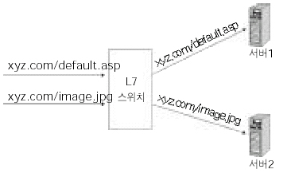

# 네트워크 기기

```
길벗 출판사, 면접을 위한 CS 전공 지식 노트를 요약한 글임을 미리 밝힙니다. 문제가 될 경우 삭제 조치 하겠습니다.
```

## TOC

1. [네트워크 기기의 처리 범위](#1-네트워크-기기의-처리-범위)
2. [애플리케이션 계층 처리 기기](#2-애플리케이션-계층-처리-기기)
3. [인터넷 계층을 처리하는 기기](#3-인터넷-계층을-처리하는-기기)
4. [테이터 링크 계층을 처리하는 기기](#4-데이터-링크-계층을-처리하는-기기)
5. [물리 계층을 처리하는 기기](#5-물리-계층을-처리하는-기기)

---

## 1. 네트워크 기기의 처리 범위

- 네트워크 기기는 계층별로 처리 범위를 나눌수 있다.
- 물리 계층을 처리할 수 있는 기기
- 데이터 링크 계층을 처리할 수 있는 기기 등이 있다.
- 상위 계층을 처리하는 기기는 하위 계층을 처리할 수 있지만 그 반대는 불가능 하다.

> L7 스위치는 애플리케이션 계층을 처리하는 기기로, 그 밑의 모든 계층의 프로토콜을 처리할 수 있지만 물리 계층인 AP는 물리 계층만 처리 가능하다.

## 2. 애플리케이션 계층 처리 기기

> 대표적으로 L7 스위치가 있다.

**L7 스위치 :**

- 스위치는 여러 장비를 연결하고 데이터 통신을 중재하며 목적지가 연결된 포트로만 전기 신호를 보내 데이터를 전송하는 통신 네트워크 장비이다.

<p align ="center">
    
</p>

- 로드 밸런서라고도 한다.
- 서버의 부하를 분산하는 역할을 한다.
- URL, 서버, 캐시, 쿠기를 기반으로 트래픽을 분산한다.
- 바이러스, 불필요한 외부 데이터를 걸러내는 필터링 기능 또한 가지고 있다.
- 응용 프로그램 수준의 트래픽 모니터링도 가능하다.
- 장애가 발생한 서버가 있다면 트래픽 분산 대상에서 제외 시킴 => 정기적인 헬스 체크를 이용

**L4 스위치와 L7 스위치 차이 :**

> L4 스위치는 인터넷 계층을 처리하는 기기로 스트리밍 관련 서비스에서는 사용할 수 없으며 메시지를 기반으로 인식하지 못하고 `IP와 포트`를 기반으로 트래픽을 분산한다.
> 반면 L7 로드밸런서는 IP, 포트 외에도 URL, HTTP 헤더, 쿠키 등을 기반으로 트래픽을 분산한다. AWS에는 ALB, NLB 컴포넌트를 제공한다.

**헬스 체크 :**

- L4, L7 스위치 모두 헬스 체크를 통해 정상적인 서버 또는 비정상적인 서버를 판별한다.
- 전송 주기와 재전송 횟수 등을 설정한 이후 반복적으로 서버에 요청을 보낸다.
  - ex) TCP 요청을 보냈는데 3-way handshake가 정상적으로 일어나지 않으면 비정상 서버다.

**로드밸런서를 이용한 서버 이중화:**

- 로드밸런서는 대표적인 기능으로 서버 이중화를 들 수 있다.
- 서비스를 안정적으로 운용하기 위해서 2대 이상의 서버는 필수적(단일 장애점 제거)

## 3. 인터넷 계층을 처리하는 기기

> 대표적인 기기로 라우터, L3 스위치가 있다.

**라우터:**

- 여러 개의 네트워크를 연결, 분할, 구분시켜주는 역할을 한다.
- 다른 네트워크에 존재하는 장치끼리 서로 데이터를 주고받을 때 패킷 소모를 최소화하고 경로를 최적화하여 패킷을 포워딩하는 역할을 한다.
- 포워딩과 라우팅을 수행

**L3 스위치:**

- L2 스위치의 기능과 라우팅 기능을 갖춘 장비를 말한다.
- 라우터라고 봐도 무방
- 라우터는 SW 기반 라우팅과 HW 기반 라우팅을 하는 것으로 나누어지고, HW 기반 라우팅을 담당하는 장치를 L3 스위치라고 한다.

**L3 스위치와 L2 스위치 비교**

| 구분        | L2 스위치       | L3 스위치     |
| ----------- | --------------- | ------------- |
| 참조 테이블 | MAC 주소 테이블 | 라우팅 테이블 |
| 참조 PDU    | 이더넷 프레임   | IP 패킷       |
| 참조 주소   | MAC 주소        | IP 주소       |

## 4. 데이터 링크 계층을 처리하는 기기

> 대표적으로 L2 스위치와 브리지가 있다.

**L2 스위치 :**

- 장치들의 MAC 주소를 MAC 주소 테이블을 통해 관리하며, 연결된 장치로부터 패킷이 왔을 때 패킷 전송을 담당

- IP 주소를 이해하지 못해, IP 기반 라우팅 불가능
- 패킷의 MAC 주소를 읽어 스위칭하는 역할을 한다.
- 목적지가 MAC 주소 테이블에 없다면 전체 포트에 전달(플러딩)
- MAC 주소 테이블의 주소는 일정 시간 이후 삭제하는 기능 존재

**브리지 :**

- 두 개의 LAN을 상호 접속할 수 있도록 하는 통신망 연결 장치
- 포트와포트 사이의 다리 역할을 한다.
- 장치에서 받아온 MAC 주소를 MAC 주소 테이블로 관리
- 통신망 범위 확장 및 서로 다른 LAN 등으로 이루어진 하나의 통신망을 구축할 때 사용

## 5. 물리 계층을 처리하는 기기

> NIC, 리피터, AP등이 있다.

**NIC :**

- LAN 카드라고 하는 네트워크 인터페이스 카드
- 2대 이상의 컴퓨터 네트워크를 구성하는 데 사용
- 네트워크와 빠른 속도로 데이터를 송수신할 수 있도록 컴퓨터 내에 설치하는 확장 카드
- LAN 카드에는 주민번호처럼 고유의 식별번호인 `MAC 주소`가 있다.

**리피터 :**

- 약해진 신호를 증폭하여 다른 쪽에 전달하는 장치
- 패킷을 더 멀리 보낼 수 있다.
- 광케이블 보급에 따라 현재 잘 사용되지 않음

**AP :**

- Access Point는 패킷을 복사하는 기기
- AP에 유선 LAN을 연결한 후 다른 장치에서 무선 LAN 기술(와이파이 등)을 사용하여 무선 네트워크 연결을 할 수 있다.
